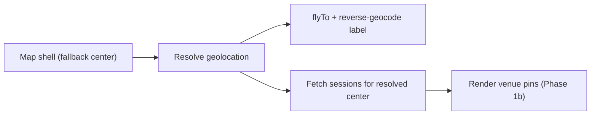

# Phase 1a — Map Canvas

**Epic:** Session Discovery Dashboard  
**Prerequisite:** [`PLAN_phase_0_foundation.md`](PLAN_phase_0_foundation.md)  
**Next phase:** [`PLAN_phase_1b_pins_tooltips.md`](PLAN_phase_1b_pins_tooltips.md)  
**Estimated effort:** 1.5 days

---

## Objective

Stand up the full-bleed map canvas on `/dashboard`: a dark Mapbox map **centered on the user's current location**, the `DashboardClient` shell, the loading skeleton, and layout integration. **No pins or overlays yet** — venue pins land in Phase 1b and search/filters in Phase 1c. Deliverable: a dark map that opens where the user actually is.

**Location rule:** If the user is in Cebu (or anywhere else), the map must open on **their device coordinates** — not a fixed global city. Example: player in Cebu → map flies to Cebu at zoom 13; search overlay shows `Cebu City` (via reverse geocode). Only when geolocation is denied does the map fall back to the Cebu City default from Phase 0.

---

## Layout Architecture

The dashboard page becomes a **full-bleed map canvas** with absolutely positioned overlay panels (overlays added in later sub-phases). The existing `DashboardLayout` sidebar remains; only the main content area changes.

```
DashboardLayout (sidebar + main)
└── dashboard/page.tsx (Server Component)
    └── <Suspense fallback={<DashboardSkeleton />}>
          └── DashboardClient.tsx (Client Component, h-full relative)
                ├── DashboardMap (z-0, absolute inset-0)           ← this sub-phase
                ├── MapSearchOverlay (z-20, top-center)            ← Phase 1c
                ├── ViewToggle (z-30, top-right)                   ← Phase 1c
                ├── QuickSessionButton (z-30, bottom-left)         ← Phase 3
                └── ActiveSessionBanner (z-20, top)                ← Phase 4
```

**Critical CSS:** Main content area must allow full height:

```tsx
// DashboardClient root
<div className="relative h-[calc(100dvh-var(--dashboard-header-offset,0px))] w-full overflow-hidden">
```

Coordinate with `DashboardLayout` — may need `dashboard` route to opt out of `max-w-[1400px]` padding. Add a layout flag or route-specific class on the main slot.

---

## Checklist

### 1a.1 — Refactor dashboard page

**File:** `apps/client/src/app/(protected)/dashboard/page.tsx`

- Remove placeholder cards
- Keep `metadata` export
- Render `<DashboardClient />` inside `<Suspense>`
- Optionally prefetch discover query on server (Phase 0+ API) and pass as `initialSessions` prop

```tsx
export default function DashboardPage() {
  return (
    <Suspense fallback={<DashboardSkeleton />}>
      <DashboardClient />
    </Suspense>
  );
}
```

**Acceptance:** Page is a thin server shell; no Mapbox imports at page level.

---

### 1a.2 — DashboardClient root

**File:** `apps/client/src/app/(protected)/dashboard/DashboardClient.tsx`

Responsibilities (this sub-phase establishes the shell; later items are wired in 1b/1c):

1. Read `dashboardViewMode` from Redux; render map when `mode === 'map'`
2. Call `useGeolocation()` — device position is the **source of truth** for map center and discover API `lat`/`lng`
3. Pass `center` and `flyToUserLocation` to `DashboardMap` when `isUserLocation === true`
4. Call `useSessionDiscovery(center, filters)` — refetches when center updates after geolocation resolves (renders no pins yet in 1a)
5. `selectedVenueKey` / `venueModalKey` local state — **added in Phase 1b**
6. `filters` local state synced with `MapSearchOverlay` — **added in Phase 1c**

**Geolocation UX:**

| State | Behavior |
|-------|----------|
| Loading | Map renders immediately on Cebu fallback; search overlay shows `Locating you…` |
| Granted | `map.flyTo` device coords at zoom 13; overlay shows city name (e.g. `Cebu City`); sessions refetch for new center |
| Denied | Stay on Cebu fallback; overlay shows `Cebu City, Philippines`; optional manual search later |
| Recenter tap | User taps location row in search overlay → `refresh()` re-requests geolocation |

**Load sequence (decision):** Map first → location → sessions. Concretely:

1. **Map shell paints immediately** on the Cebu fallback center — never blocked by geolocation or data
2. **Geolocation resolves** (device coords) → `flyTo` + reverse-geocode the label
3. **Sessions fetch for the resolved center** — `useSessionDiscovery` is `enabled` only once a center exists, and refetches when the center changes after geolocation resolves

Location must resolve before (or together with) the session fetch because the discover query is keyed on `lat`/`lng` — fetching sessions for the fallback center and then again for the real center would double-fetch and flash wrong pins. Optional optimization: the server component (`page.tsx`) may prefetch sessions for the fallback center so the first paint has pins, then the client refetches when device location resolves.



**Acceptance:** Map loads on first paint; geolocation does not block render; sessions fetch only after a center is known; granted permission always recenters on user's actual position.

---

### 1a.3 — DashboardMap component

**Folder:** `apps/client/src/components/modules/dashboard/dashboard-map/`

**File:** `DashboardMap.tsx`

Props (full interface defined here; the pin/selection/join handlers are consumed starting in Phase 1b):

```typescript
interface DashboardMapProps {
  venueGroups: VenueSessionGroup[];   // [] in 1a; populated in 1b
  center: SessionGeoPoint;
  zoom?: number;                      // default USER_LOCATION_ZOOM (13)
  selectedVenueKey: string | null;    // 1b
  onSelectVenue: (venueKey: string | null) => void;     // 1b
  onOpenVenueModal: (venueKey: string) => void;         // 1b
  onJoinSession: (sessionId: string) => void;           // 1b
  onViewportChange?: (center: SessionGeoPoint, zoom: number) => void;
  flyToUserLocation?: boolean;
}
```

When `flyToUserLocation` is true and `center` changes (e.g. geolocation granted), call `mapRef.flyTo({ center: [lng, lat], zoom: 13, duration: 1200 })`.

Implementation:

- `react-map-gl` `Map` imported from **`react-map-gl/mapbox`** (v8 import path) with `mapboxAccessToken={process.env.NEXT_PUBLIC_MAPBOX_TOKEN}`
- `mapStyle={MAPBOX_STYLE_URL}`
- `reuseMaps` prop for performance
- Disable default attribution compact or move to bottom-left per design
- Custom map controls: none (use pinch/scroll zoom only) OR minimal zoom +/- styled with ROTRA tokens

**Atmospheric overlay** (from HTML mockup):

```tsx
<div className="pointer-events-none absolute inset-0 z-10 bg-[radial-gradient(circle_at_50%_50%,rgba(0,255,136,0.05)_0%,transparent_70%)]" />
```

**Acceptance:** Dark map fills viewport; pans smoothly; no layout shift; renders with empty `venueGroups`.

---

### 1a.4 — DashboardSkeleton

**File:** `apps/client/src/components/modules/dashboard/dashboard-skeleton/DashboardSkeleton.tsx`

Full-viewport pulsing `bg-surface-dim` with centered spinner or map-shaped placeholder. Reuse the existing `skeleton/Skeleton` primitive.

Used by `Suspense` and dynamic map loading state.

---

### 1a.5 — Dashboard layout integration

**File:** `apps/client/src/layouts/DashboardLayout/DashboardLayout.tsx`

Add support for full-bleed child routes:

- Detect `/dashboard` pathname OR accept `fullBleed` prop from layout
- Remove `max-w` / padding constraints on main slot for dashboard
- Ensure sidebar offset (`ml-64` at lg) still applies

**Acceptance:** Map extends edge-to-edge within main content area (not under sidebar).

---

## Storybook stories

| Component | Stories |
|-----------|---------|
| `DashboardMap` | Default (empty venueGroups), Loading/skeleton |

---

## Files Created / Modified (summary)

| Action | Path |
|--------|------|
| Rewrite | `apps/client/src/app/(protected)/dashboard/page.tsx` |
| Create | `apps/client/src/app/(protected)/dashboard/DashboardClient.tsx` |
| Create | `components/modules/dashboard/dashboard-map/DashboardMap.tsx` |
| Create | `components/modules/dashboard/dashboard-skeleton/DashboardSkeleton.tsx` |
| Modify | `apps/client/src/layouts/DashboardLayout/DashboardLayout.tsx` |

---

## Phase 1a Acceptance

- [ ] `/dashboard` shows full-screen dark Mapbox map as default view
- [ ] Map load sequence: shell paints first, then geolocation, then sessions fetch for resolved center
- [ ] Geolocation centers map on user's actual position (e.g. Cebu when in Cebu)
- [ ] Map flies to device coords when permission granted; Cebu fallback when denied
- [ ] Map extends edge-to-edge in the main content area (not under sidebar)
- [ ] No SSR errors; dynamic import for map (`ssr: false`)
- [ ] `DashboardSkeleton` shown while the map loads
- [ ] `pnpm build` passes

---

## Handoff to Phase 1b

Phase 1b consumes:

- The `DashboardMap` canvas + `DashboardClient` shell
- `useSessionDiscovery` returning `venueGroups`
- Adds `VenuePin`, `VenuePinTooltip`, `VenueSessionsModal`, and `SessionUnavailableDialog`, plus the `selectedVenueKey`/`venueModalKey` state in `DashboardClient`
