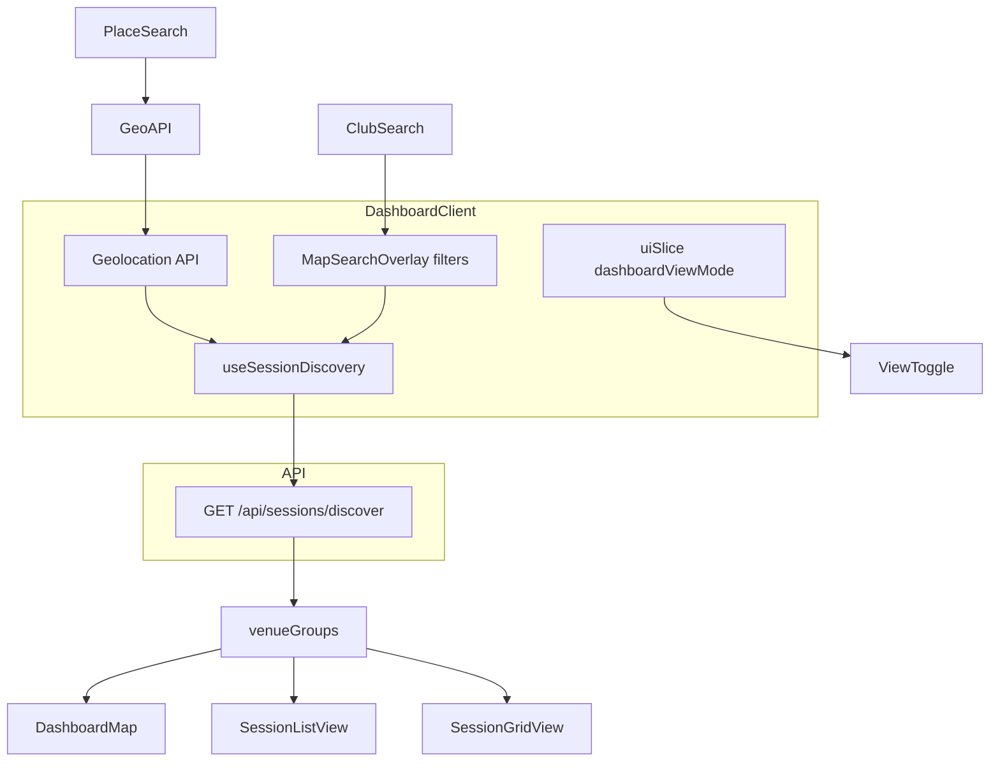

# Phase 1c — Search, Filters & View Toggle

**Epic:** Session Discovery Dashboard  
**Prerequisite:** [`PLAN_phase_1b_pins_tooltips.md`](PLAN_phase_1b_pins_tooltips.md)  
**Next phase:** [`PLAN_phase_2_list_grid_views.md`](PLAN_phase_2_list_grid_views.md)  
**Estimated effort:** 1.5–2 days

---

## Objective

Add the discovery controls on top of the map: a dual-mode search overlay (place + club), the full `FilterPanel`, and the Map/List/Grid view toggle. Deliverable: users can re-center by place, filter pins by club and availability, and switch the view mode.

This sub-phase wires the `filters` state in `DashboardClient` that feeds `useSessionDiscovery(center, filters)`.

---

## Checklist

### 1c.1 — MapSearchOverlay

**Folder:** `apps/client/src/components/modules/dashboard/map-search-overlay/`

**File:** `MapSearchOverlay.tsx`

Position: `absolute top-20 left-1/2 -translate-x-1/2 z-20 w-full max-w-md px-4`

**Two distinct search modes — toggled by tab or icon inside the input row** (reuse `tabs/Tabs`):

| Mode | Icon | Input label | Action |
|------|------|-------------|--------|
| Place | `MapPin` | "Province, city, street…" | Forward-geocode via Mapbox → re-center map + refetch sessions for new coords. Scope: province/region down to street. **Only `country` is excluded** (Mapbox `types` param: `region,place,locality,neighborhood,address`) so e.g. "Cebu" province resolves. |
| Club | `Building2` | "Search clubs…" | Filter `sessionDiscoveryFilters.clubQuery` — narrows pins by club name without moving the map |

**UX flow for Place search:**

1. User taps/clicks the Place tab (active by default)
2. Input is editable — shows current city from reverse geocode as placeholder
3. As user types, call Mapbox Geocoding API with `types=region,place,locality,neighborhood,address` (province/region down to street; no country level)
4. Dropdown of up to 5 suggestions appears below the input
5. Selecting a suggestion: set `placeQuery` → geocode → update map `flyTo` new center → refetch sessions

**UX flow for Club search:**

1. User taps Club tab
2. Input accepts free text
3. Each keystroke updates `clubQuery` in filters (debounce 300ms)
4. Map pins filter live — only venues that have at least one session matching the club name remain visible
5. No map re-center (location is unchanged)

**Filter row** (below the search inputs):

A horizontal row of quick-access chips + a dedicated **Filters** button (`SlidersHorizontal` icon) that opens the full `FilterPanel`.

Quick chips (horizontal scroll):

| Chip | Filter |
|------|--------|
| Nearby (< 2km) | `radiusKm: 2` |
| Doubles Only | `playersPerCourt: 4` |
| Weekend | `weekendOnly: true` |

Chips work in both search modes. Active chip: `border-primary-container/20 bg-primary-container/5 text-primary-container`.

The **Filters button** shows a badge dot when any filter inside the panel is active.

**Fallback (geolocation):** When no place search is active, the input row shows the device city label from `useGeolocation.locationLabel`. Tapping it with no text calls `refresh()` to re-center on current position.

**Acceptance:** Place search re-centers map to city/street; club search filters pins without moving map; both searches work with chips; Filters button opens `FilterPanel`.

---

### 1c.2 — FilterPanel

**Folder:** `apps/client/src/components/modules/dashboard/filter-panel/`

**File:** `FilterPanel.tsx`

The FilterPanel is the full filter surface opened by the Filters button.

**Trigger & container:**

| Breakpoint | Component | Behaviour |
|------------|-----------|-----------|
| Mobile (< 768px) | existing `mobile-drawer/MobileDrawer` (bottom) | Slides up from bottom edge; swipe-down to dismiss |
| Desktop (≥ 768px) | existing `popover/Popover` anchored to Filters button | Dropdown panel; close on outside click |

> Reuse the existing `MobileDrawer` and `Popover` primitives — there is no `Sheet` primitive in this codebase. The availability radios reuse `radio-group/RadioGroup`.

**Header row:**

```
Filters                                  [Clear all]
```

- "Clear all" resets all panel filters to undefined; disabled when nothing is active

**Filter section — Availability:**

```
AVAILABILITY

  ○  Not Full      (only sessions with open slots)
  ○  Full          (only sessions with no open slots)
```

- Radio group — single select: "Not Full" | "Full" | neither (show all)
- **Default = neither (show all).** Full sessions are NOT hidden by default — cancellations can reopen a slot and players can still waitlist
- Labels: uppercase micro `text-[10px] font-bold tracking-widest`
- Active radio: `text-primary-container`

**Filter section — Coming soon (placeholder):**

```
MORE FILTERS

  [ Schedule Type ]          COMING SOON
  [ Match Format  ]          COMING SOON
  [ Skill Level   ]          COMING SOON
```

- Each row: filter label (muted) + `COMING SOON` badge (`bg-surface-container-high text-on-surface-variant text-[9px] uppercase rounded-full px-2 py-0.5`)
- Rows are non-interactive (no checkbox/radio); they signal the product roadmap

**Apply button — dynamic count:**

Before any filter is ticked, the button shows the total unfiltered count:

```
  12 sessions
```

As soon as the user selects one or more filters, the button updates live to reflect the matched count:

```
  Show 7 sessions
```

- Neutral wording "sessions" (not "available") — full sessions are valid results, so "available" would be misleading when the Full filter is active
- Count is derived client-side from current `venueGroups` + pending filter state (not an API call)
- Counts individual sessions across all visible venue groups that pass the pending filters
- Button style: full-width, `bg-primary-container text-on-primary-fixed font-black uppercase`
- Tapping the button commits `pendingFilters → activeFilters`, closes the panel, and triggers a session refetch

**State model:**

```typescript
// FilterPanel manages its own pending state; only commits on Apply
const [pendingFilters, setPendingFilters] = useState(activeFilters);
const matchCount = useMemo(() => countMatchingSessions(venueGroups, pendingFilters), [...]);
```

**Acceptance:**
- Mobile: panel slides up from bottom; desktop: popover anchors to Filters button
- "Not Full" / "Full" radio mutually exclusive; neither = show all
- Apply button shows total count ("12 sessions") when no filter active; shows "Show X sessions" as soon as a filter is ticked
- Default availability = show all; full sessions are not hidden
- Tapping Apply commits filters + closes panel
- "Clear all" resets pending filters to undefined
- "Coming Soon" items are visible but non-interactive

---

### 1c.3 — ViewToggle

**Folder:** `apps/client/src/components/modules/dashboard/view-toggle/`

**File:** `ViewToggle.tsx` + `ViewToggle.variants.ts`

Position: `absolute top-20 right-8 z-30`

Three buttons in glass pill container:

| Mode | Icon | Label |
|------|------|-------|
| map | `Map` (lucide) | MAP VIEW |
| list | `List` | LIST |
| grid | `LayoutGrid` | GRID |

Active tab: `bg-primary-container text-on-primary-fixed shadow-md`

Dispatches `setDashboardViewMode` to Redux on click.

Phase 1c: List/Grid buttons dispatch mode change but show placeholder or same map until Phase 2.

**Acceptance:** Toggle updates Redux; active state visually matches mockup.

---

## Interaction Spec (search & filters)

| Action | Device | Result |
|--------|--------|--------|
| Type in Place search | Both | Geocode → flyTo new center → refetch sessions |
| Select place suggestion | Both | Close suggestions; flyTo; clear input |
| Type in Club search | Both | Filter pins by club name (debounced 300ms) |
| Tap quick chip | Both | Toggle filter; refetch sessions |
| Tap Filters button | Both | Open FilterPanel (MobileDrawer on mobile, Popover on desktop) |
| Tick availability filter | Both | Pending filter updates; Apply button → "Show X sessions" |
| Tap Apply in FilterPanel | Both | Commit filters; close panel; refetch sessions |
| Tap Clear all in FilterPanel | Both | Reset all pending panel filters |
| Toggle view to List/Grid | Both | Redux update (Phase 2 renders alternate view) |

---

## Data Flow



---

## Storybook stories

| Component | Stories |
|-----------|---------|
| `MapSearchOverlay` | Place mode default, Club mode, Filters active, No geolocation |
| `FilterPanel` | No filters (count only), Not Full selected, Full selected, Clear all |
| `ViewToggle` | Map active, List active, Grid active |

---

## Files Created / Modified (summary)

| Action | Path |
|--------|------|
| Create | `components/modules/dashboard/map-search-overlay/MapSearchOverlay.tsx` |
| Create | `components/modules/dashboard/filter-panel/FilterPanel.tsx` |
| Create | `components/modules/dashboard/view-toggle/ViewToggle.tsx` |
| Create | `components/modules/dashboard/view-toggle/ViewToggle.variants.ts` |
| Modify | `apps/client/src/app/(protected)/dashboard/DashboardClient.tsx` (filters state) |

---

## Phase 1c Acceptance

- [ ] Place search geocodes and re-centers map (province/region down to street; no country results)
- [ ] Club search filters pins without moving map
- [ ] Quick chips and FilterPanel both refetch/filter correctly
- [ ] FilterPanel slides up from bottom on mobile; popover on desktop
- [ ] Availability filter: Not Full / Full radio; neither = show all
- [ ] Apply button shows total session count by default; updates to "Show X sessions" as filters are toggled
- [ ] Full sessions remain visible by default; availability filter is opt-in
- [ ] Apply commits filters and closes panel; Clear all resets
- [ ] Coming Soon items visible but non-interactive
- [ ] View toggle visible top-right; updates Redux state
- [ ] Search overlay shows city name from reverse geocode; recenter tap works
- [ ] Storybook stories for all new components
- [ ] `pnpm build` passes

---

## Handoff to Phase 2

Phase 2 adds:

- `SessionListView` and `SessionGridView` rendered when `dashboardViewMode !== 'map'`
- Shared `SessionDiscoveryCard` extracted from tooltip/modal layout
- View transitions without remounting discovery data
