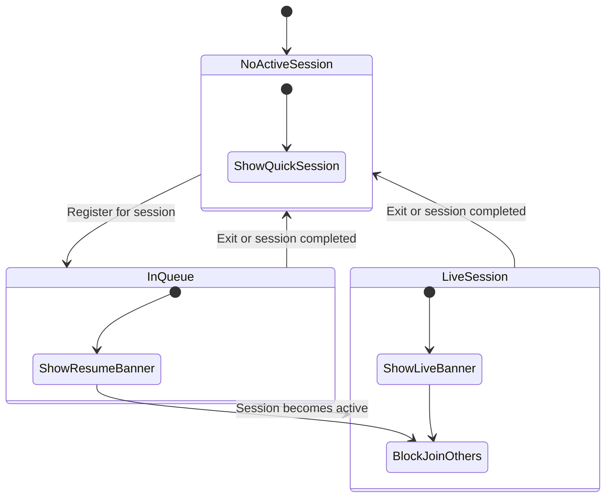

# Phase 4 — Active Session Guard

**Epic:** Session Discovery Dashboard  
**Prerequisite:** Phases 1a–1c, 3  
**Estimated effort:** 2 days

---

## Objective

Detect when the current user is already registered in an active queue session and prevent starting a duplicate Quick Session. Transform the CTA into **RESUME SESSION**, show an Active Session Banner, and display a blocking prompt if the user attempts to join another session while in-queue.

---

## Definitions

### "Active session" (for guard purposes)

A user is **in an active session** when they have a `session_registrations` row where:

| Field | Condition |
|-------|-----------|
| `admission_status` | `accepted` OR `waitlisted` OR `reserved` |
| `player_status` | NOT `exited` |
| Session `status` | `open` OR `active` |

```sql
SELECT sr.*, qs.*
FROM session_registrations sr
JOIN queue_sessions qs ON qs.id = sr.session_id
WHERE sr.player_id = :currentUserId
  AND sr.admission_status IN ('accepted', 'waitlisted', 'reserved')
  AND sr.player_status != 'exited'
  AND qs.status IN ('open', 'active')
ORDER BY qs.date_time DESC
LIMIT 1;
```

If multiple rows match (edge case), prefer:

1. `active` session over `open`
2. `playing` / `waiting` player status over `not_arrived`
3. Most recent `date_time`

---

## UX Spec

### Active Session Banner

Adapted from [`docs/views/client_app/common/home.md`](docs/views/client_app/common/home.md) Active Session Banner.

Position: top of dashboard overlay, below search bar (`absolute top-4 left-4 right-4 z-25` on map view; sticky top on list/grid).

```
┌────────────────────────────────────────────────────────────┐
│ 🟢 LIVE  •  Court 2 next          Sunrise Badminton Club   │
│                                    [ VIEW SESSION → ]      │
└────────────────────────────────────────────────────────────┘
```

| Element | Spec |
|---------|------|
| Background | `bg-accent-subtle` / `primary-container/10` |
| Left stripe | 3px `primary-container` |
| Live dot | 8px pulse animation |
| Label | `LIVE` uppercase when session `active`; `IN QUEUE` when `open` |
| CTA | Navigates to `/sessions/[sessionId]` |
| Tap target | Entire banner clickable |

Show when `useActiveSession().data` is non-null.

---

### Quick Session CTA — guarded states

| User state | Button label | Action |
|------------|--------------|--------|
| No active session | `START QUICK SESSION` | Open QuickSessionSheet |
| In active session (`open`) | `RESUME SESSION` | Navigate to active session href |
| In active session (`active`) | `RESUME SESSION` | Navigate to active session href |
| In active session, taps Quick Session anyway | Blocking dialog | See below |

**Resume button style:** Same pill shape; gradient circle shows `play` or `hourglass` icon instead of `+`; label stack:

- Line 1: `ACTIVE SESSION`
- Line 2: `RESUME SESSION`

---

### Blocking dialog

When user in active session attempts to:

- Open Quick Session sheet (if we keep a secondary entry point)
- Click **Join** on another session card/pin

Show `AlertDialog`:

```
You're already in a session

You're registered at Sunrise Badminton Club.
Leave that session before joining another.

[ GO TO MY SESSION ]    [ Stay here ]
```

- Primary: navigate to active session
- Secondary: dismiss

**Join button behavior:** Intercept `onJoin` on `SessionDiscoveryCard` — if active session exists, show dialog instead of navigating.

---

## Checklist

### 4.1 — Wire useActiveSession to Prisma

**File:** `apps/client/src/app/api/sessions/active/route.ts`

Replace mock with real query (see SQL above). Return:

```typescript
{
  active: {
    sessionId: string;
    clubName: string;
    location: string;
    status: "open" | "active";
    playerStatus: string;
    admissionStatus: string;
    courtHint: string | null;  // e.g. "Court 2 next" if waiting
    href: `/sessions/${sessionId}`;
  } | null
}
```

**Court hint logic (v1):** If `player_status === 'waiting'`, show "Up next"; if `playing`, show "On court"; else omit.

**Acceptance:** API returns correct active session for test user; null when none.

---

### 4.2 — useActiveSession hook (finalize)

**File:** `apps/client/src/hooks/useActiveSession.ts`

```typescript
export function useActiveSession() {
  return useQuery({
    queryKey: ["sessions", "active"],
    queryFn: () => fetch("/api/sessions/active").then((r) => r.json()),
    refetchInterval: 30_000,
    refetchOnWindowFocus: true,
    staleTime: 10_000,
  });
}
```

**Acceptance:** Dashboard refetches active state every 30s and on tab focus.

---

### 4.3 — ActiveSessionBanner component

**Folder:** `apps/client/src/components/modules/dashboard/active-session-banner/`

**File:** `ActiveSessionBanner.tsx`

Props: `session: ActiveSessionSummary`, `onNavigate: () => void`

Integrate into `DashboardClient` above map/list/grid content.

**Acceptance:** Banner visible only when active; pulse on live; navigates on click.

---

### 4.4 — Guard QuickSessionButton

**File:** `dashboard/DashboardClient.tsx`

```tsx
const { data: activeData } = useActiveSession();
const active = activeData?.active ?? null;

<QuickSessionButton
  variant={active ? "resume" : "create"}
  onClick={() => {
    if (active) {
      router.push(active.href);
    } else {
      setSheetOpen(true);
    }
  }}
/>
```

Do not render `QuickSessionSheet` when `active` is set (or render but never open).

**"Disabled" create behavior (Q: disabled quick match while in session):** The create flow is made **unreachable** while the user is in a session — the primary CTA is repurposed to `RESUME SESSION` (it does not open the sheet). If any *secondary* entry point to Quick Session exists (e.g. a menu item), it must use `QuickSessionButton`'s `disabled` prop (reduced opacity, no-op) and/or route through the blocking dialog. There is never a path to create a second session while active.

**Acceptance:** While in a session, the create sheet cannot be opened; the CTA shows Resume and navigates to the active session.

---

### 4.5 — Guard Join CTAs

**File:** `dashboard/DashboardClient.tsx` or wrapper hook `useSessionJoinGuard.ts`

```typescript
function handleJoinSession(targetSessionId: string) {
  // 1. Active-session guard (this phase)
  if (active && active.sessionId !== targetSessionId) {
    setBlockedDialogOpen(true);
    return;
  }
  // 2. Availability check (Phase 1b SessionUnavailableDialog) — target may be stale
  //    The /sessions/[id] route / pre-check resolves closed|completed|cancelled|404
  //    → show SessionUnavailableDialog instead of navigating.
  router.push(`/sessions/${targetSessionId}`);
}
```

The two guards **compose**: the active-session block takes precedence; if the user is free to join, the stale/unavailable check (`SessionUnavailableDialog`, defined in Phase 1b) handles a session that has since closed or filled.

Pass `onJoin={handleJoinSession}` to:

- `SessionDiscoveryCard`
- `VenuePinTooltip` and `VenueSessionsModal`
- `SessionListView` / `SessionGridView`

**Acceptance:** Join on different session while in queue shows blocking dialog.

---

### 4.6 — AlreadyInSessionDialog

**Folder:** `apps/client/src/components/modules/dashboard/already-in-session-dialog/`

**File:** `AlreadyInSessionDialog.tsx`

shadcn `AlertDialog` with copy from UX spec above.

Props: `open`, `onOpenChange`, `activeSession: ActiveSessionSummary`

**Acceptance:** Primary CTA navigates to active session.

---

### 4.7 — Invalidate on session state change

When user exits session or session completes, active guard should clear.

Mutations that invalidate `["sessions", "active"]`:

- Exit session (future)
- Session status webhook (future)
- Manual refetch on dashboard mount

**Acceptance:** After leaving session (manual DB update in dev), banner disappears within 30s or on refocus.

---

### 4.8 — Edge cases

| Case | Behavior |
|------|----------|
| Waitlisted in session A, tries to join session B | Block with dialog |
| **Currently playing a match (`player_status = 'playing'`)** | **Guarded — counts as active. Banner shows "On court"; CTA = Resume → navigates into the live session** |
| Resting/eating mid-session | Guarded — `player_status != 'exited'`, still in an active session |
| Accepted in session A, session A is `closed`/`completed` | Guard does not apply; query returns null |
| Host of session A, tries Quick Session B | Block — host is also registered |
| QM managing session (not registered as player) | No guard — QM is not in `session_registrations` unless they joined as player |
| Same session Join click | Allow navigate (no-op if already on page) |
| Join a session that became unavailable | Not an active-session block — falls through to `SessionUnavailableDialog` (Phase 1b) |

---

### 4.9 — Active Courts carousel (stretch)

If implementing bottom-right carousel from mockup:

- Only show sessions with `status === 'active'` from discovery data
- Highlight user's active session if present
- Hide when user has no nearby active courts

Defer if time-constrained.

---

### 4.10 — Storybook

| Component | Stories |
|-----------|---------|
| `ActiveSessionBanner` | Live active, Open/in queue |
| `QuickSessionButton` | Resume variant |
| `AlreadyInSessionDialog` | Open state |

---

## State Diagram



---

## Files Created / Modified (summary)

| Action | Path |
|--------|------|
| Modify | `apps/client/src/app/api/sessions/active/route.ts` |
| Modify | `apps/client/src/hooks/useActiveSession.ts` |
| Create | `active-session-banner/ActiveSessionBanner.tsx` |
| Create | `already-in-session-dialog/AlreadyInSessionDialog.tsx` |
| Modify | `quick-session-button/QuickSessionButton.tsx` (resume variant) |
| Modify | `dashboard/DashboardClient.tsx` |
| Modify | `session-discovery-card/SessionDiscoveryCard.tsx` (join guard prop) |

---

## Phase 4 Acceptance

- [ ] `GET /api/sessions/active` returns real active registration from DB
- [ ] Active Session Banner shown when user is in open/active session
- [ ] Quick Session button becomes Resume Session when guarded
- [ ] Join on another session shows blocking dialog
- [ ] Dialog primary CTA navigates to current session
- [ ] Guard clears when user no longer in active session
- [ ] Storybook stories for banner, resume button, dialog
- [ ] `pnpm build` passes

---

## Epic Complete

When Phase 4 acceptance criteria pass, the Session Discovery Dashboard epic is **done**. Run full manual QA:

1. Open `/dashboard` — map loads with pins
2. Switch List / Grid — data consistent
3. Start Quick Session — creates session, redirects
4. Return to dashboard while in session — Resume shown, Join blocked
5. Navigate to active session via banner

Update master plan checkboxes in [`PLAN_session_discovery_dashboard.md`](PLAN_session_discovery_dashboard.md) (manual, not automated).
