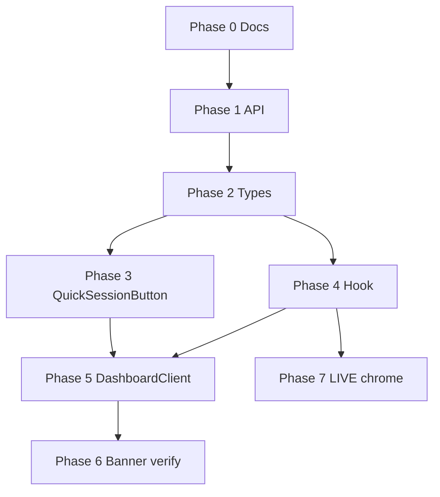

# PLAN — QM Session Active State (Master Index)

> **Feature:** Refine dashboard and chrome so a Que Master / host who creates a **future** Quick Session is **enrolled** but not shown as **in an active session** until timing or lifecycle criteria are met.
>
> **Status:** Phase 0 (docs) complete · Phases 1–7 pending implementation
>
> **Do not implement code until each phase plan is reviewed.**

---

## Problem

When a QM creates a Quick Session via `QuickSessionButton` on `/dashboard`:

1. `POST /api/sessions/quick` creates a session with `status: open` and auto-registers the host as `accepted` / `not_arrived`.
2. `GET /api/sessions/active` returns that registration immediately — **no date/time check**.
3. `DashboardClient` treats any `active` response as in-session → `QuickSessionButton` shows **ACTIVE SESSION / RESUME SESSION** and `ActiveSessionBanner` appears.

This is wrong for future sessions. Scheduling ≠ operating.

---

## Canonical rule (added in docs)

| Sub-state | Criteria | Dashboard UI |
|-----------|----------|--------------|
| **`current`** | DB `active`, **or** DB `open` with `dateTime <= now` | Banner + `resume` button |
| **`scheduled`** | DB `open` with `dateTime > now` | `scheduled` button only — no banner, no LIVE strip |
| **none** | No qualifying enrollment | `create` button |

**Join guard** (unchanged intent): user with `current` **or** `scheduled` enrollment cannot join another session without leaving first.

---

## Phase index

| Phase | Plan file | Scope | Depends on |
|-------|-----------|-------|------------|
| **0** | [`PLAN_phase_0_qm_session_docs.md`](./PLAN_phase_0_qm_session_docs.md) | Documentation — enrolled vs in-session | — |
| **1** | [`PLAN_phase_1_qm_active_session_api.md`](./PLAN_phase_1_qm_active_session_api.md) | `GET /api/sessions/active` split response | 0 |
| **2** | [`PLAN_phase_2_qm_session_types.md`](./PLAN_phase_2_qm_session_types.md) | TypeScript types | 1 |
| **3** | [`PLAN_phase_3_qm_quick_session_button.md`](./PLAN_phase_3_qm_quick_session_button.md) | `QuickSessionButton` `scheduled` variant | 2 |
| **4** | [`PLAN_phase_4_qm_active_session_hook.md`](./PLAN_phase_4_qm_active_session_hook.md) | `useActiveSession` + selectors | 2 |
| **5** | [`PLAN_phase_5_qm_dashboard_client.md`](./PLAN_phase_5_qm_dashboard_client.md) | `DashboardClient` wiring | 3, 4 |
| **6** | [`PLAN_phase_6_qm_active_session_banner.md`](./PLAN_phase_6_qm_active_session_banner.md) | Banner gate verification | 5 |
| **7** | [`PLAN_phase_7_qm_live_chrome.md`](./PLAN_phase_7_qm_live_chrome.md) | Navbar/sidebar LIVE strip (spec + wiring) | 4 |

---

## Execution order

---

## Files touched (full feature)

### Docs (Phase 0 — done)
- `docs/views/client_app/common/session_discovery_dashboard.md`
- `docs/business_logic/client_app/08_queue_session.md`
- `docs/views/client_app/common/quick_session_sheet.md`
- `docs/views/client_app/que_master/que_master_console.md`
- `docs/views/client_app/components/navbar-que-master.md`
- `docs/views/client_app/components/sidebar-que-master.md`
- `docs/views/client_app/components/sidebar-player.md`

### Code (Phases 1–7 — pending)
- `apps/client/src/app/api/sessions/active/route.ts`
- `apps/client/src/types/session-discovery.ts`
- `apps/client/src/hooks/useActiveSession/client.ts`
- `apps/client/src/hooks/useActiveSession/server.ts` (types only)
- `apps/client/src/components/modules/dashboard/quick-session-button/QuickSessionButton.tsx`
- `apps/client/src/components/modules/dashboard/quick-session-button/QuickSessionButton.stories.tsx`
- `apps/client/src/app/(protected)/dashboard/DashboardClient.tsx`
- `apps/client/src/components/modules/dashboard/active-session-banner/ActiveSessionBanner.stories.tsx`
- `apps/client/src/components/modules/dashboard/already-in-session-dialog/AlreadyInSessionDialog.stories.tsx`
- Future: navbar/sidebar LIVE strip components (not yet built)

---

## End-to-end acceptance (all phases)

| Scenario | Expected dashboard |
|----------|-------------------|
| QM creates Quick Session for **tomorrow** | `UPCOMING SESSION` / `VIEW SESSION` — no banner |
| QM creates Quick Session for **now** (past `dateTime`) | `IN QUEUE` banner + `RESUME SESSION` |
| QM starts session (DB → `active`) | `LIVE` banner + `RESUME SESSION` |
| Player enrolled in future session taps Join elsewhere | `AlreadyInSessionDialog` blocks |
| No enrollment | `START QUICK SESSION` |

---

## Out of scope

- Changing Quick Session creation flow (`POST /api/sessions/quick`)
- Auto-transitioning DB status `open` → `active` at `dateTime` (host still taps Start Session)
- Player join/register API (still mock/stub)
- Multiple concurrent enrollments UI (API picks best; edge case documented only)
