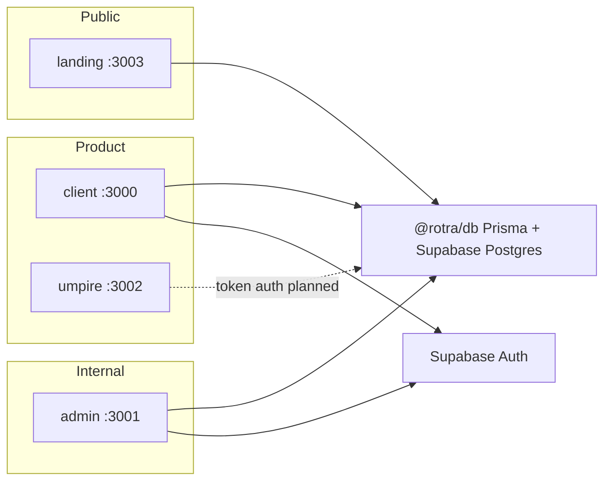
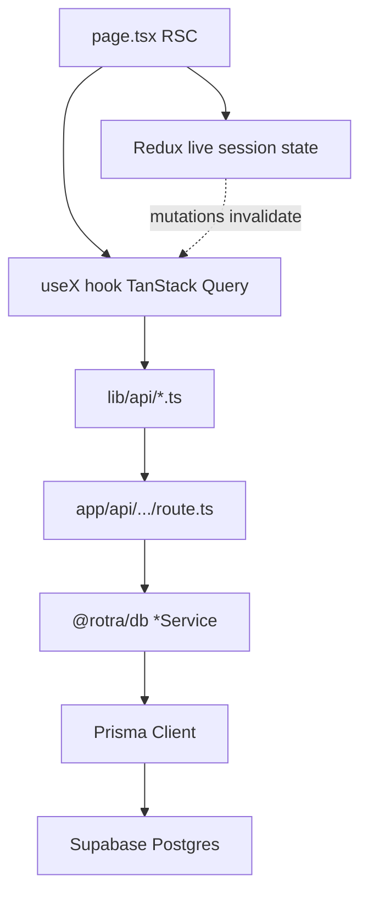
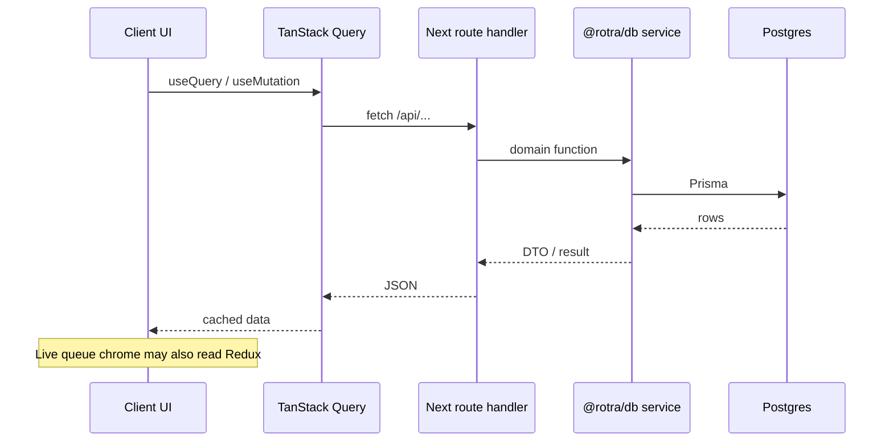

# ROTRA — Repository Summary

> **Deep reference / human onboarding / audits.** Agents: start at root [`AGENTS.md`](../AGENTS.md)
> and load only the `.agents/context/` slices your task needs. Do not read this entire file for a
> one-line fix (~13k tokens).

**Last verified against the tree:** 2026-08-26 (partial — see `.agents/context/` for load-bearing truth)

---

## Table of contents

0. [How to use this file](#0-how-to-use-this-file)
1. [The product](#1-the-product)
2. [The product as a whole](#2-the-product-as-a-whole)
3. [The tech stack](#3-the-tech-stack)
4. [Current state](#4-current-state)
5. [Repo structure](#5-repo-structure)
6. [Coding principles](#6-coding-principles)
7. [Doc vs code drift](#7-doc-vs-code-drift)
8. [Appendices](#8-appendices)

---

## 0. How to use this file

### Authority order

When sources disagree, use this order (matches root `AGENTS.md`):

1. **The code that is wired** — what actually runs
2. **`openspec/specs/<domain>/spec.md`** for CURRENT implemented behavior (SHALL/MUST + scenarios)
3. **`.agents/context/known-drift.md`** — docs that lie; Reality column wins
4. **`AGENTS.md`** + on-demand `.agents/context/` slices
5. **This file** for narrative / deep background
6. **`docs/business_logic/`** for product intent (may be unbuilt)
7. **`docs/techstack/`** for conventions (several sections are stale — see §7)

From `openspec/config.yaml`:

> OpenSpec specs under `openspec/specs/` are the source of truth for CURRENT implemented behavior. Documented product rules from `docs/business_logic` may appear in a clearly labeled "Documented product rules" section on an existing spec, or in a standalone spec whose Status says they are not implemented. Do not claim planned rules are implemented. If code and business docs disagree, Current requirements win for what the product does now. Do not invent APIs or screens that are not in the docs or existing specs.

### Suggested read order for a new agent task

1. §1 Product pitch (why the product exists)
2. §4 Current state for the app you are touching (what is real vs mock)
3. §2 Ubiquitous language + roles (use exact terms)
4. §6 Coding principles + §7 Drift (how to write code here)
5. §5 Structure (where new code goes)
6. Open the matching `openspec/specs/<domain>/spec.md` before implementing

### Hard constraints for agents

- Never invent APIs, screens, or domain terms that are not in this file, an OpenSpec, or existing code.
- Never present a `docs/business_logic` rule as shipped unless the matching OpenSpec (or code) confirms it.
- Spelling: **Que Master** (not “Queue Master”); **Que Session** / **Que Schedule** are synonyms; product name is **ROTRA** (all-caps in human-facing copy).
- Prefer the **actual** data-fetching pattern in this repo (API route handlers + `@rotra/db` services) over the older “Server Actions everywhere” wording in some tech docs. See §6 and §7.

---

## 1. The product

### Elevator pitch

**ROTRA** is a centralized **badminton session operating system** for casual and semi-competitive club nights. It solves a concrete community problem: *no one knows when they play, who they played, or how good they actually are.* Unfair whiteboard rotation, missing match records, skill mismatches, opaque court/shuttle cost splits, and no lasting player identity.

The product combines:

- Queue-based match management (live queue / court / attendance)
- Player identity, peer skill tracking, and competitive MMR
- Transparent court + shuttle cost splitting
- Club-based organization and Que Master operations
- Gamified EXP / tiers and leaderboards

Positioning is **utility infrastructure first**, not a social network.

### Problem → product

| Pain today | What ROTRA provides |
|------------|---------------------|
| Whiteboard / group-chat rotation is unfair and opaque | Match Queue + Automatic Queueing candidates for Que Masters |
| No durable match history | Persistent match records and Rate and Review |
| Skill mismatches and sandbagging | Six-dimension Skill Rating + MMR ladder + calibration |
| Opaque court/shuttle money | Cost formula, Unpaid/Paid/Partial tracking |
| No lasting player identity | Profiles, clubs, notifications, sharing |

### Target audiences

| Audience | Need |
|----------|------|
| Casual → semi-competitive **Players** | Fair court time, live queue clarity, persistent identity |
| **Que Masters** who run sessions manually today | 1–2 tap ops instead of whiteboards / group chat |
| **Club Owners** | Structure, membership, records, costs without heavy admin |

Secondary: venues; players tracking improvement. **MVP out of scope:** pro/tournament orgs, coaching plans, spectator/broadcast products. Tournaments are Phase 3.

### Brand

| Element | Spec |
|---------|------|
| Name meaning | Coined brand word — **no literal meaning, no acronym** |
| UI name | **ROTRA** always all-caps |
| Tagline | **Run the game.** |
| Positioning line | *The operating system for badminton sessions — queue management, skill tracking, and match flow in one place.* |
| Personality | Precise · Fast · Neutral · Reliable |
| Marketing headlines | e.g. **Queue. Play. Track.** / *The badminton session platform* |
| Visual identity | Dark default + light toggle; tokens via CSS vars; font **Satoshi**; status-first hierarchy; one primary green CTA |
| Mascots | **Rion** (system operator / queue controller); **Tara** (flow / rhythm / balance) |
| Toast voice | “You're up.” · “Queue updated.” · “Match ready.” · “Score saved.” |

Landing value pillars: Fair queues; Live sessions; Player stats & identity; Reviews & skill signal; Club sessions & members; Court & shuttle costs.

---

## 2. The product as a whole

### 2.1 Four apps

| App | Package | Path | Port | Product purpose |
|-----|---------|------|------|-----------------|
| Landing | `@rotra/landing` | `apps/landing` | **3003** | Public coming soon + waitlist; legal pages; no auth |
| Client | `@rotra/client` | `apps/client` | **3000** | Primary product for Players, Club Owners, Que Masters |
| Admin | `@rotra/admin` | `apps/admin` | **3001** | Internal ops: approvals, customers, places, kill switches, config |
| Umpire | `@rotra/umpire` | `apps/umpire` | **3002** | Minimal live scoring PWA; one match via one-time token/QR |



### 2.2 Roles (exact spelling)

Roles are **additive, not exclusive**. A Club Owner in Club A is still a Player in Club B.

| Role | Scope | How granted |
|------|-------|-------------|
| **Player** | Platform-wide default | Facebook OAuth (or email invite → Facebook link) |
| **Club Owner** / Host | Per club | Admin-approved `club_application` mints `clubs` with `owner_id` |
| **Que Master** | Per club | Club Owner assigns active members (multiple allowed; no self-assign) |
| **Umpire** | Per match | Que Master assigns; Preset vs On-the-fly; Authenticated vs **Quick Umpire** (guest via one-time token) |
| **Admin** | Platform-wide | Internal only; Admin app (email + password + OTP) |

**Spelling rules that matter:**

- **Que Master** — never “Queue Master”
- **Que Session** / **Que Schedule** — synonyms for the same core entity
- **Quick Umpire** — guest scorer; score-only unless authenticated
- **Rate and Review** — canonical CTA name (not “leave a review” alone)

**Admin-app internal roles** (distinct from player roles):

- **Founding Super Admin** — seeded; cannot be deactivated/demoted via UI
- **Super Admin** — can manage other admins
- **Platform Admin** (`admin_role = 'admin'`) — full platform authority; read-only on Admins module

### 2.3 Capability map (36 OpenSpec domains)

One line each. Status of *implementation* is in §4 — do not assume every row below is fully shipped.

| Spec folder | Description |
|-------------|-------------|
| `product-vision` | Purpose, audiences, design constraints, MVP out-of-scope |
| `ubiquitous-language` | Canonical vocabulary contract |
| `canonical-rules` | Non-negotiable RULE-* checklist from business logic |
| `user-roles` | Player / Club Owner / Que Master / Quick Umpire / Admin model |
| `auth-flow` | Client Facebook OAuth; gated admin/tester paths |
| `onboarding` | Mandatory first-run profile wizard for regular players |
| `landing` | Coming-soon home, waitlist API, legal pages |
| `legal` | Client Terms / Privacy / Data Deletion pages |
| `settings` | Settings hub; account edit / self-delete |
| `clubs` | Club apply path (live); browse/join/manage largely mock in UI |
| `queue-session` | Session discovery, create/start/close, lobby/console, waitlist/attendance |
| `automatic-queueing` | Intelligent matchmaking engine generating candidate matches |
| `umpire-overview` | Temporary match-scoped scoring role |
| `umpire-token-access` | One-time Quick Umpire token/QR lifecycle |
| `umpire-scoring` | Points, undo, sets, deuce UI behavior |
| `umpire-realtime` | WebSocket broadcast, smart monitoring, offline queue |
| `umpire-score-submission` | Final score lock, Client review trigger, dispute/void |
| `skill-rating` | Six-dimension peer rating, weights, window, anti-sandbagging |
| `mmr-calibration` | First-N competitive matches with amplified MMR deltas |
| `review-system` | Rate and Review: who, anonymity, filter, completion |
| `cost-system` | Session cost formula, payment tracking, early-exit settlement |
| `gamification` | EXP, tiers, MMR eligibility, asymmetry, void reversals |
| `leaderboard` | Session/club/future global boards; scored-only; snapshots |
| `match-history` | Persistent per-player match records and retention rules |
| `player-profile` | Own and public profile surfaces |
| `player-comparison` | Side-by-side H2H / partner / skill comparison |
| `notifications` | Client notification inbox / badges |
| `sharing` | Shareable artifacts, privacy, link expiry |
| `tournament` | Phase 3 brackets/formats/EXP multipliers (not MVP) |
| `admin-overview` | Admin purpose, access model, audit logging, analytics framing |
| `admin-auth` | Admin email/password auth, invites, password set, session gates |
| `admin-approvals` | Admin review of club applications; demotions placeholder |
| `admin-users` | Customers, testers, platform admins, tags, waitlist tools |
| `admin-places` | Venue/place CRUD and review of player-submitted places |
| `admin-platform` | Kill switches, config, analytics, MMR/skills, moderation (many still mock) |
| `admin-notifications` | Admin inbox + super-admin broadcast API / side-effect alerts |

### 2.4 Ubiquitous language (terms agents get wrong)

| Term | Short definition |
|------|------------------|
| **ROTRA** | Product name; coined; always all-caps in human-facing copy |
| **Que Session** / **Que Schedule** | Core operational unit (same entity); synonyms |
| **Club Que Session** | Created under a club; **Session type** required: `MMR` or `Fun Games` |
| **Friendly Que Session** | Informal; always Regular; no EXP/MMR |
| **Session type `MMR`** | Competitive; EXP + MMR move (“Competitive / Ranked / MMR-eligible”) |
| **Session type `Fun Games`** | Recorded club session; **no** EXP/MMR (≠ Friendly) |
| **Match Queue** | Ordered upcoming matches *inside* a session (not the session itself) |
| **Player Pool** | Rotation-eligible players (`I Am Prepared`, `Waiting`, optionally `Resting`) |
| **Admission state** | Whether the player has a seat (Accepted / Waitlisted / …) |
| **Player status** | What they’re doing now (`Not Arrived` → `I Am In` → `I Am Prepared` → Playing/Waiting/…) |
| **Capacity / Slot** | `players_per_court × number_of_courts`; one Accepted seat = one slot |
| **Playing level** | Self-declared Beginner/Intermediate/Advanced; cosmetic; self-only |
| **Skill Rating** | Peer-computed **1.0–5.0** across **six dimensions**; all session types |
| **MMR** | Competitive ladder; start **1000**, floor **0**; only Club Que Session — MMR |
| **Tier** | Cosmetic EXP badge: Cadet → Warrior → Elite → Master → Titan → Apex / Apex Predator |
| **EXP** | Gamification currency driving Tier; match EXP only on Club Que Session — MMR |
| **Rate and Review** | Canonical CTA; **Rating** = numeric stars; **Review** = optional text |
| **Finalized / Completed / Voided** | Match outcomes; Voided reverses EXP/MMR; never call Voided “Unscored” |
| **Automatic Queueing** | Intelligent candidate matchmaking engine (≠ Manual Queueing; ≠ session waitlist) |
| **Candidate match** | Generated lineup not yet approved / queued |
| **Quick Umpire** | Guest scoring via one-time token; score-only unless authenticated |
| **Kill switch** | Admin feature off-switch without deploy |
| **Club Application** | Request to create a club; Admin approval mints club + owner |
| **Blacklist** | Per-club silent block; remove member first; un-blacklist ≠ re-admit |
| **Court cost / Shuttle cost / Markup** | Cost inputs; per-player = ceil(total / accepted) + markup |
| **Lobby** | Player-facing session detail; becomes Overview when Active |
| **Smart Monitoring** | Near-end score threshold alerts (e.g. 90% of win condition) |

**Six Skill Dimensions:** Attack, Defense, Net & Touch, Precision & Control, Athleticism, Game Intelligence.

**Critical distinctions:**

- **Skill Rating ≠ MMR ≠ Tier ≠ Playing level** — four different concepts
- **Fun Games ≠ Friendly** — Fun Games is a club session type; Friendly is informal/clubless
- **Admission state ≠ Player status** — seat vs activity
- **Match Queue ≠ session waitlist ≠ Automatic Queueing** — three different mechanisms

### 2.5 Core mechanics (documented product rules)

These are the business rules the product is designed around. Many are **not fully implemented in UI** yet — check §4 and the matching OpenSpec before claiming they ship.

#### Sessions and queueing

- Only Club Owner or Que Master may create Que Sessions in canonical rules (note: current code also allows player **Quick Session** create — documented conflict in `user-roles` / `queue-session` specs).
- Lifecycle: `Draft → Open → Active → Closed → Completed` (or `Cancelled`).
- Capacity = `players_per_court × number_of_courts`; overflow → session waitlist FIFO.
- Two parallel state machines: **admission** vs **player status**. Rotation-eligible: `I Am Prepared`, `Waiting`, optionally `Resting`.
- **`I Am In`** is irreversible by the player after confirmation; **Early Exit** replaces ordinary cancel after arrival and requires settlement.
- Free cancel cutoff: **5 hours** before start (default).
- **Automatic Queueing** generates **candidates** (teams, suitability, warnings, explanations); Que Master approval required unless Full Automatic. Modes: Fun/Relaxed, Normal/Balanced, Training Style, Overload Training. Manual Queueing always available.
- **Request a Match** is a proposal only — does not bypass Match Queue.

#### Skill rating

- Distinct from Playing level, MMR, and Tier.
- Rater weights: Que Master ×3, Umpire ×3, Opponent ×2, Partner ×1.5, Self ×1 (self phases out after external assessments accumulate).
- Window: **24 hours** after match completion/finalize.
- Anti-sandbagging flags override displayed level for QMs/Club Owners when multiple signals fire.

#### MMR and calibration

- Starts at **1000**; floor **0**; absolute MMR Admin-only; players see **MMR Gain/Loss**.
- First **N** matches (default **10**): deltas × `calibration.mmr_multiplier` (default **2.0**), stacked with asymmetry multiplier.
- Voiding calibration matches decrements `mmr_matches_played` and can re-enter calibration.
- Calibration does **not** affect queue priority or eligibility.

#### Cost splitting

```
total_cost = court_cost + Σ(consumed_tubes × cost_per_tube)
per_player = ceil(total_cost / accepted_players) + markup
```

- Statuses: **Unpaid / Paid / Partial**; manual tracking (no payment gateway in MVP).
- Players see **own** cost only; markup/profit → Club Owner / Que Masters.
- Early exit requires full settlement (not pro-rated). Session Completed only when obligated players are Paid.

#### Reviews

- Player→Player **text is anonymous** to the rated player; QM / authenticated umpire Rate-and-Review is **named** and higher-weighted.
- Guest Quick Umpires: score only — **cannot rate**.
- Profanity filter on Review text before submit.
- Que Master finalize can complete without all reviews; remaining reviews may still apply within window.

#### Gamification

- Cosmetic only — **no effect on queue priority**.
- Match EXP / MMR only on **Club Que Session — MMR**.
- Tiers never decrease below achieved (including after voids).
- Mixed-rank asymmetry: lower-rated gain less / lose more when carried; higher-rated opposite.

#### Design constraints (vision)

- Que Master ops in **1–2 taps**
- Players see only relevant state
- **Verifiable** results (no unchecked self-reporting)
- **Live** queue state
- Additive roles

---

## 3. The tech stack

### 3.1 Stack at a glance

| Concern | Technology | Version / pin |
|---------|------------|---------------|
| Package manager | pnpm | `11.0.8` (`packageManager`); engines `>=11` |
| Node | Node.js | `v24` (`.nvmrc`); engines `>=24` |
| Monorepo | Turborepo | `latest` in root deps |
| Framework | Next.js App Router | `^15.2.4` |
| UI | React | `^19.1.0` |
| Language | TypeScript | `^5.8.3` (strict via `@rotra/config`) |
| Styling | Tailwind CSS 4 | `^4.1.3` |
| Components | shadcn/ui (source-owned per app) | CLI `shadcn` `^4.x` |
| Server state | TanStack Query v5 | `^5.96.2` |
| Client state | Redux Toolkit | `^2.11.2` (client + admin deps today) |
| Data tables | TanStack Table v8 | client + admin |
| Forms | React Hook Form + Zod + `@hookform/resolvers` | RHF `^7.56.1`, Zod `^3.25.0` |
| ORM | Prisma | `^6.19.3` (`@rotra/db`) |
| Database / Auth / Realtime / Storage | Supabase | `@supabase/ssr` `^0.10.2`, `@supabase/supabase-js` `^2.103.2` |
| Maps | Mapbox GL + react-map-gl | client (+ admin deps) |
| Toasts | sonner | client / admin / landing |
| Storybook | Storybook Next.js | `^10.3.4` |
| Lint | Biome | `^2.4.10` |
| Format | Prettier + `prettier-plugin-tailwindcss` | `^3.5.3` |
| Git hooks | Husky | `^9.1.7` |
| Commits | commitlint + conventional | `^20.5.0` |
| Deploy | Vercel (one project per app) | Node 24.x |
| Testing | **None installed** | no vitest / jest / playwright / cypress |

### 3.2 Workspace layout

```
apps/*      → landing, client, admin, umpire
packages/*  → db, config, legal-content
```

| Package | Purpose |
|---------|---------|
| `@rotra/db` | Prisma schema/client, generated types, domain **services** (not a repository layer) |
| `@rotra/config` | Shared `tsconfig/base.json` + Tailwind tokens (`./tsconfig`, `./tailwind`) |
| `@rotra/legal-content` | Shared Terms / Privacy / Data Deletion React content (client + landing) |

### 3.3 Per-app stack differences

| Concern | Landing | Client | Admin | Umpire |
|---------|---------|--------|-------|--------|
| Rendering | Static-first marketing | **SSR-first** | **SSR-first** | Static shell + CSR (planned) |
| Auth | None | Facebook OAuth via Supabase; tester/admin gate passwords | Email + password + email OTP; `role === admin` | One-time token (documented; **not built**) |
| Redux | No | Yes | Deps present | Docs say yes; **not in package.json** |
| Mapbox | No | Yes | Deps present | No |
| Prisma / `@rotra/db` | Waitlist create | Heavy | Heavy (service role) | None yet |

### 3.4 Auth by app

- **Client:** Facebook OAuth via Supabase Auth; `@supabase/ssr` cookies; middleware; password paths for tester / admin-gate logins. **No MFA/TOTP** on client.
- **Admin:** email + password + email OTP; middleware requires Supabase user + `role === admin` in metadata; service-role key server-side for invites.
- **Umpire (documented):** one-time DB token in middleware; optional Supabase session if logged in. **Not implemented** in the app today.
- **Landing:** public only.

### 3.5 External services (actually in code)

| Service | Status |
|---------|--------|
| Supabase Auth | Wired (client + admin) |
| Postgres via Prisma | Wired (`@rotra/db`) |
| Mapbox (maps + geocoding) | Wired (client + admin) |
| Facebook OAuth | Client login |
| Email | HTML templates for Supabase Auth / admin invite (paste into Supabase dashboard) — **no Resend/SendGrid SDK** |
| Vercel cron | Admin `/api/cron/club-applications-sla` (implies Vercel-style cron when deployed) |
| Google Places / analytics / Stripe | **Not in code** |

### 3.6 Environment variables

**Public (apps):**

- `NEXT_PUBLIC_SUPABASE_URL`
- `NEXT_PUBLIC_SUPABASE_ANON_KEY`
- `NEXT_PUBLIC_MAPBOX_TOKEN`
- `NEXT_PUBLIC_MAPBOX_STYLE_URL`
- `NEXT_PUBLIC_ADMIN_APP_URL`
- `NEXT_PUBLIC_CLIENT_APP_ORIGIN`

**Server:**

- `DATABASE_URL` — Supabase tx pooler (often `:6543`); `@rotra/db` may add `pgbouncer=true`
- `DIRECT_URL` — direct URL for migrations
- `SUPABASE_SERVICE_ROLE_KEY`
- `MAPBOX_SECRET_TOKEN`
- `FOUNDING_SUPER_ADMIN_ID`
- `CLIENT_ADMIN_LOGIN_GATE_PASSWORD`
- `ROTRA_DEV_PROFILE_ID`

Create `packages/db/.env` for Prisma; each app may have `.env.local` for public keys.

### 3.7 Turbo pipeline

| Task | Behavior |
|------|----------|
| `build` | `dependsOn: ["^build"]`; inputs include `.env*`; outputs `.next/**` (excl. cache), `dist/**` |
| `dev` | `cache: false`, `persistent: true` |
| `lint` | `dependsOn: ["^lint"]` |
| `type-check` | `dependsOn: ["^type-check"]` |

### 3.8 Quality tooling pins

**Prettier (`.prettierrc`):** `semi: false`, `singleQuote: true`, `tabWidth: 2`, `trailingComma: "es5"`, `printWidth: 100`, Tailwind class sort plugin.

**Biome (`biome.json`):** recommended rules; `noExplicitAny: error`; `noUnusedVariables: error`; `noArrayIndexKey: off`; Tailwind CSS directives parser enabled.

**Commitlint:** extends `@commitlint/config-conventional` only.

**TypeScript (`packages/config/tsconfig/base.json`):** `strict`, `strictNullChecks`, `noUncheckedIndexedAccess`, `noImplicitReturns`, `noImplicitOverride`, `exactOptionalPropertyTypes`, `verbatimModuleSyntax`, target ES2022, Bundler resolution.

---

## 4. Current state

**Maturity verdict (blunt):** Mid-stage. Strong scaffolding (schema, Storybook, admin/client shells). Real backends for waitlist, auth, club applications, places, sessions discovery/lifecycle APIs, customers/testers/admins, notifications. Large surface of **UI-only / mock** screens. **Umpire is a stub.** **Zero automated tests.** Schema and OpenSpec run **ahead** of shipped UI.

### 4.1 Headline numbers

| Metric | Value |
|--------|-------|
| OpenSpec capability folders | 36 |
| Prisma models | 36 (11 domain-split files + enums) |
| Prisma enums | 46 |
| Migrations | 15 (2026-04-16 → 2026-06-19) |
| Client pages / route handlers | 40 / 31 |
| Admin pages / route handlers | 26 / 44 |
| Landing pages / route handlers | 4 / 1 |
| Umpire pages / route handlers | 1 / 0 |
| Storybook stories | 181 (client 108, admin 57, landing 13, umpire 3) |
| Automated tests | **0** (no test runner in any `package.json`) |
| `'use server'` files in repo | **1** (`apps/client/src/lib/auth/login-actions.ts`) |
| Total commits (as of 2026-08-25) | ~197 since 2026-04-05 |
| Commits last 30 / 90 days | ~24 / ~69 |

### 4.2 What is actually built (working-looking)

**Landing**

| Path | Status |
|------|--------|
| `/` | Implemented — coming-soon marketing |
| `/privacy`, `/terms`, `/data-deletion` | Implemented — `@rotra/legal-content` |
| `POST /api/waitlist` | Implemented — Prisma `waitlistSignup.create` |

**Client — real core**

| Path / area | Status |
|-------------|--------|
| `/login`, `/auth/callback` | Facebook OAuth via server action |
| `/login-admin`, `/login-tester`, `/set-password` | Gated / invite tester flows |
| `/onboarding` | Profile-aware wizard + `/api/onboarding/complete` |
| `/dashboard` (`/home` redirects) | Mapbox map, session discovery, quick session, active-session banner |
| `/find-sessions`, `/find-sessions/[sessionId]` | Prefetches open/user sessions |
| `/clubs/apply` | React Query + club-application mutations |
| `/notifications` | `@rotra/db` inbox |
| `/settings`, `/settings/account` | Substantial; account tied to profile APIs |
| `/profile`, `/profile/[userId]` | Profile API shell; **subcards still mock** |
| Legal pages | Implemented |
| Sessions APIs | 13 handlers: quick/active/discover/available/my + id start/close/leave/live/roster/console |

**Admin — ops core**

| Path / area | Status |
|-------------|--------|
| `/login`, `/login/otp`, `/set-password`, `/auth/accept-invite`, `/auth/callback` | Implemented |
| `/waitlist` | Real list + stats |
| `/customers`, `/customers/[id]` | Real directory + detail |
| `/places` | Real CRUD/review |
| `/testers`, `/testers/[id]` | Real invite/revoke/resend |
| `/admins`, `/admins/[id]` | Real user management |
| `/approvals/club-applications` | Real approve/reject/bulk + SLA cron |
| `/tags` | Real tag definitions |
| `/notifications` | Real inbox + broadcasts |
| `/profile` | Thin but session-backed |

**`@rotra/db` services (real):** admin-user, admin-notification, club-application, customer-profile, player-profile, profile-tag, tag-definition, tester-invitation, notification, notification-broadcast.

**Seed:** skill dimensions + ranking tiers only.

### 4.3 Mock / UI-only / stub (looks finished but is not)

**Client**

| Path | Reality |
|------|---------|
| `/` | Stub — “Player-facing app — coming soon” |
| `/sessions/join`, `/joined`, `/queue`, `/court`, `/attendance`, `/add-match` | Polished UI defaulting to **`MOCK_SESSION_*`**; local toasts |
| `/clubs`, `/clubs/explore`, `/explore` | Mock club lists |
| `/clubs/[clubId]/*` overview/members/rules/schedule/announcements | `MOCK_CLUB` / placeholders |
| `/clubs/[clubId]/manage/*` | ProvisionBox stubs; “not wired” toasts |
| Profile stats / gear / match history / skill cards | Mock + TODOs |

**Admin**

| Path | Reality |
|------|---------|
| `/dashboard` | Explicit mock KPIs/activity |
| `/analytics` | Mock KPIs + CSS bar chart |
| `/moderation` | Static rows for layout only |
| `/platform-config` | Mock rows; Edit does not persist |
| `/kill-switches` | Local UI state only |
| `/skills-management`, `/mmr-management` | In-memory defaults, not persisted |
| `/approvals/demotions` | Explicit placeholder |

**Umpire**

| Path | Reality |
|------|---------|
| `/` | **Stub** — “Live scoring interface — coming soon.” |
| Specs | 5 umpire OpenSpecs with **no matching app implementation** |

### 4.4 Documented / OpenSpec but largely absent in apps

- Full umpire scoring / realtime / token access
- Tournament, leaderboard product surfaces, player comparison, automatic queueing engine UI
- Full review / MMR calibration product surfaces
- Broad RLS / realtime beyond `places` (docs describe more than migrations apply)
- Google Places enrichment (`docs/adr/superseded-google-places-chatgpt-note.md` — never built; code uses Mapbox)
- Automated test suite

### 4.5 Database maturity

| Domain | Models (count) |
|--------|----------------|
| Profile / identity | Profile, ProfileTag, EmailInvitation, TesterInvitation, GearItem, GearItemLink, SkillDimension, PlayerSelfAssessment (8) |
| Club | Club, ClubMember, ClubJoinRequest, ClubBlacklist, ClubMembershipAuditLog, ClubApplication (6) |
| Session | QueueSession, SessionRegistration (2) |
| Match | Match, MatchPlayer (2) |
| Review / skills | MatchReview, MatchReviewRating, PlayerSkillRating (3) |
| Gamification | ExpTransaction, MmrTransaction, RankingTierConfig, SandbaggingFlag (4) |
| Notifications | Notification, NotificationBroadcast (2) |
| Places | Place (1) |
| Waitlist | WaitlistSignup (1) |
| Tags | TagDefinition (1) |
| Admin | AdminActionLog, AdminInvitation, AdminNotification, KillSwitch, PlatformConfig, ModerationFlag (6) |

**RLS:** only **`places`** has `ENABLE ROW LEVEL SECURITY` + policies in migrations. Broader RLS is documented more than migrated.

**Honest gap:** Schema covers matches, reviews, MMR/EXP, club membership, moderation, kill switches — many without full app CRUD UI yet.

### 4.6 Activity and dead weight

**90-day touch heat:** `apps/client` ≫ `apps/admin` ≫ `docs` / `openspec` ≫ `packages/db`. Landing and umpire near-idle.

| Path | What it is |
|------|------------|
| `exported/` | Logo/asset exports (1x/2x/SVG) — design assets |
| `otf-web-fonts/` | Font package; apps also ship `public/fonts` |
| `.next/` at repo root | Stale cache; real builds live under each app |
| `docs/adr/superseded-google-places-chatgpt-note.md` | Historical Google Places note — Mapbox shipped instead |
| `apps/*/storybook-static/` | Built Storybook artifacts |
| `openspec/specs/` | 36 specs; many describe behavior not yet in apps |

### 4.7 Bottom line for agents

Treat as the **real product core**:

- Landing waitlist + legal
- Client: Facebook login, middleware, onboarding, dashboard discovery + quick session APIs, find-sessions, club apply, places search/submit, notifications, profile API shell, settings/account
- Admin: OTP/password auth, waitlist, customers, places, testers, admin users, club application approvals (+ SLA cron), tags, notifications/broadcasts

Treat as **design-system / mock ahead of backend**:

- Entire umpire app
- Client live queue/court/attendance/join chrome
- Clubs social hub and manage screens
- Admin dashboard, analytics, moderation, platform-config, kill-switches, skills/MMR editors

---

## 5. Repo structure

### 5.1 Annotated top-level tree

```
rotra-app/
├── apps/
│   ├── landing/          # Public coming soon / waitlist (port 3003)
│   ├── client/           # Player / Club Owner / Que Master app (port 3000)
│   ├── admin/            # Internal dashboard (port 3001)
│   └── umpire/           # Live scoring PWA — stub today (port 3002)
├── packages/
│   ├── db/               # @rotra/db — Prisma schema, client, domain services
│   ├── config/           # @rotra/config — shared tsconfig + Tailwind tokens
│   └── legal-content/    # @rotra/legal-content — Terms / Privacy / Data Deletion
├── docs/
│   ├── business_logic/   # Product rules (may include unbuilt rules)
│   ├── techstack/        # Coding conventions (see §7 for drift)
│   ├── database/         # Schema domain docs + RLS intent
│   ├── branding/         # Brand kit
│   ├── marketing/        # Landing copy / structure
│   ├── forms/            # Form-specific product notes
│   ├── plans/            # Implementation plans
│   ├── email-templates.md # Supabase Auth template coverage matrix (13 slots × 2 apps)
│   └── views/            # View/screen inventories
├── openspec/
│   ├── config.yaml       # Spec-driven workflow rules
│   ├── specs/            # Current-behavior specs (37 domains)
│   └── changes/          # Active OpenSpec changes (often empty / gitkeep)
├── .agents/skills/       # Repo skills: create-component, form audit/correct, shadcn, supabase
├── .cursor/
│   ├── commands/         # opsx-propose / apply / archive / explore / sync / update
│   └── skills/           # OpenSpec Cursor skills
├── .github/workflows/    # biome.yml (PR lint matrix: client, admin, umpire)
├── .husky/               # pre-commit lint; pre-push lint+build; commit-msg commitlint
├── email-templates/      # Shared Supabase Auth HTML (paste into dashboard); per-app copies in apps/*/src/email-templates/
├── exported/             # Logo asset exports (not app code)
├── otf-web-fonts/        # Font source package
├── Makefile              # nvm + pnpm + optional ngrok helpers
├── package.json          # Root scripts
├── pnpm-workspace.yaml
├── turbo.json
├── biome.json
├── commitlint.config.js
├── .nvmrc                # v24
├── README.md             # Human setup guide
└── REPO_SUMMARY.md       # This file
```

### 5.2 Typical app `src/` layout (client / admin)

```
src/
├── app/                    # Next.js App Router (routes, layouts, route handlers)
│   ├── (protected)/        # Auth-gated route group
│   ├── (onboarding)/       # Client-only onboarding group
│   ├── api/                # Route handlers (primary write/read HTTP surface)
│   ├── auth/               # Callbacks / accept-invite
│   ├── login*/             # Auth entry
│   └── constants/          # Fixtures / constants for Storybook (no runtime logic)
├── components/
│   ├── ui/                 # Primitives (shadcn-origin + ROTRA tokens) — NOT named shadcn/
│   ├── modules/            # Feature modules composed of ui/
│   └── ...                 # layout / admin-ui / custom as needed
├── hooks/                  # React Query / feature hooks (folder per hook often)
├── lib/                    # api helpers, auth, supabase clients, geo, utils
├── server/                 # Rare; login server action lives under lib/auth today
├── store/                  # Redux store + slices (client; admin has deps)
├── providers/              # Query / Redux / theme providers
├── layouts/                # Shell layouts (client)
├── types/
├── constants/
└── middleware.ts           # Auth gate (client + admin)
```

### 5.3 Where does new code go?

| You are adding… | Put it here |
|-----------------|-------------|
| A new page / URL | `apps/<app>/src/app/.../page.tsx` (+ `layout.tsx` if needed) |
| An HTTP API | `apps/<app>/src/app/api/<feature>/route.ts` |
| Shared DB mutation / query logic | `packages/db/src/<feature>-service.ts` then call from the route |
| A UI primitive | `apps/<app>/src/components/ui/<kebab-name>/` |
| A feature module UI | `apps/<app>/src/components/modules/<feature>/` |
| A React Query hook | `apps/<app>/src/hooks/useFeatureName/` or `use-feature-name.ts` pattern used nearby |
| Client fetch helpers / query keys | `apps/<app>/src/lib/api/` |
| Live session / queue client state | Redux slice under `src/store/slices/` |
| Storybook fixtures | `apps/<app>/src/app/constants/` — never inline fixtures in stories |
| A form | Colocate `SomeForm/SomeForm.tsx`, `schema.ts`, `default.ts` under the module |
| Product behavior change | Prefer OpenSpec propose → apply workflow (`.cursor/commands/`) |
| Legal copy shared across apps | `packages/legal-content` |
| Design tokens | `packages/config/tailwind-config` — do not hardcode hex in components |



**Default write path today:** Client Component → TanStack Query `useMutation` → `fetch` / lib helper → **Route Handler** → `@rotra/db` service → Prisma.

**Not the default:** new Server Actions. There is only one `'use server'` file in the repo. Prefer matching the route-handler pattern unless there is a strong reason otherwise.

### 5.4 `packages/db` layout

```
packages/db/
├── prisma/
│   ├── schema.prisma          # Generator / datasource
│   ├── enums.prisma
│   ├── models_*.prisma        # Domain-split models
│   ├── migrations/            # 15 dated migrations
│   └── seed.ts                # Skills + tiers
└── src/
    ├── client.ts
    ├── index.ts
    ├── *-service.ts           # Domain services
    └── shared-*.ts
```

---

## 6. Coding principles

### 6.1 Architecture

| App | Rendering strategy |
|-----|--------------------|
| client | **SSR-first** — shareable pages, hydrated session, then live updates |
| admin | **SSR-first** — sensitive data must not flash before auth |
| umpire | Static shell + CSR after token validation (planned; app is stub) |
| landing | Static-first marketing |

**Next.js 15 hard rules:**

- Always type `params` as `Promise<{ ... }>` — never the raw object.
- Always make the page/layout/`generateMetadata` component `async`.
- `searchParams` follows the same `Promise` pattern.

**Boundaries:**

- Sensitive DB/auth work stays on the server (RSC, route handlers, `@rotra/db`).
- Mapbox **MUST** be client-only: `next/dynamic({ ssr: false })` or `"use client"`.
- Kill switches / feature flags: server-authoritative; client never evaluates flags alone (documented pattern).

### 6.2 Realtime scarcity

Only two Realtime use cases are intended:

1. **Smart monitoring** — match score nearing ~90% win condition → Que Master
2. **Score submitted** — match enters review phase → Court View + leaderboard

Everything else (queue, status, waitlist) → **React Query refetch on mutation success**, not persistent WebSocket. Do not invent new realtime channels casually.

### 6.3 State layer rules

| Use **TanStack Query** | Use **Redux Toolkit** |
|------------------------|------------------------|
| Profiles, match history, leaderboard, club lists, paginated admin tables | Live session queue |
| Mutations + optimistic updates | Live score / WebSocket-driven updates |
| Background refetch after mutations | Player status map in active session |
| | Offline point queue (Umpire — documented) |
| | Real-time notification state (as documented) |

**Slice conventions:**

1. All slice state typed with explicit interfaces
2. Reducers handle WebSocket event payloads directly
3. **No async thunks in slices — async is React Query's job**
4. Selectors co-located in the slice file (small slices)

Local UI chrome → React local state. Discovery data → React Query. Dashboard view mode → Redux `uiSlice` where that pattern already exists.

### 6.4 Data fetching — what to follow

**Documented ideal** (`docs/techstack/08`): Server Actions in `server/actions/` + React Query mutations.

**What the repo actually does (follow this):**

- Centralized query keys / typed fetch helpers in `lib/api/`
- **Writes and reads over HTTP** via `app/api/**/route.ts`
- Domain logic in `packages/db/src/*-service.ts`
- Exactly one Server Action: Facebook OAuth login (`apps/client/src/lib/auth/login-actions.ts`)

Forms may use either a Server Action **or** an API route when an HTTP boundary is needed — in practice, prefer API routes for consistency with the rest of the monorepo.

### 6.5 Naming conventions

| Thing | Convention |
|-------|------------|
| Route folders | kebab-case |
| Pages / layouts / loading / error | `page.tsx` / `layout.tsx` / `loading.tsx` / `error.tsx` |
| Component folder | kebab-case (`player-row/`) |
| Component files | `PascalCase.tsx`, `.stories.tsx`, `.variants.ts`, … |
| Hooks | `use-kebab-case.ts` or `useFeatureName/` folder matching neighbors |
| Utils | kebab-case `.ts` |
| Route handlers | `app/api/[feature]/route.ts` |
| Redux slices | `[feature]Slice.ts` |
| Props type | `ComponentNameProps` **in the `.tsx` only** |
| Constants | `SCREAMING_SNAKE_CASE` |

### 6.6 No barrel files

> **No `index.ts` barrel files.** Import directly from the component file. Barrel files obscure where symbols come from and slow down TypeScript resolution.

### 6.7 Component creation anatomy

Required structure:

```text
components/<category>/<component-name>/
├── ComponentName.tsx              # required (+ Props type)
├── ComponentName.stories.tsx      # required
├── ComponentName.variants.ts      # if using cva
├── ComponentName.helpers.ts       # only if 3+ pure helpers
└── ComponentName.types.ts         # only shared non-prop types
```

**Non-negotiables:**

- Functional components only; `forwardRef` when needed
- Prefer shadcn primitive as base
- Tailwind **tokens only** — no hardcoded hex in components
- `cva` recipes live in `.variants.ts`, not inline (new code)
- `cn` from `@/lib/utils`
- Props in `.tsx`, never `.types.ts`
- SHOULD support `asChild` via Radix `Slot` for single-element wrappers
- Stories cover default + each variant; fixtures from `app/constants/` (or a TODO comment), never inline fixtures
- Export naming from variants: `buttonVariants` + `ButtonVariants`

**Folders today:** `components/ui/` and `components/modules/` — **not** the older doc names `shadcn/` and `rotra/`.

**Shadcn-origin exception:** keep compound subcomponents as named exports in one parent file — do not nest kebab folders for `PaginationLink`, etc.

Use the `/rotra-create-component` skill to scaffold. That skill forbids calling `npx shadcn` itself (use WebFetch / shadcn skill separately when adding registry components).

### 6.8 Form engineering

**Stack:** React Hook Form + Zod + React Query mutations. Business logic **server-side only**.

**MUST:**

- RHF for registration / submit / field state
- **`Form` + `Controller` pattern** — MUST NOT use `register`-style wiring for primary forms
- Zod as schema source of truth
- Colocate: `SomeForm/SomeForm.tsx`, `schema.ts`, `default.ts`
- React Query for writes
- Loading / disabled during pending; prevent double-submit
- Toast success **and** failure; SHOULD show inline field errors
- Prefer app-local `components/ui` fields; native fallback **must** include the exact comment:  
  `TODO: please create field for this component`

**Callbacks:** form exposes `onSuccess` / `onError`; RHF `Form` provider stays **inside** the form component, not the parent.

**Audit / fix skills:** `/rotra-is-my-form-valid` (writes a root report, does not edit) → `/rotra-correct-my-form` (applies TODOs, re-audits, deletes report when Compliant).

### 6.9 Design system (tokens)

- **Dark mode only.** No light mode. `dark` class on `<html>`.
- Background: `bg-base` / `bg-surface` / `bg-elevated` / `bg-overlay`
- Text: `text-primary` / `text-secondary` / `text-disabled`
- Accent: `accent` / `accent-dim` / `accent-subtle` (`#00FF88` family)
- Semantic: `error`, `warning`, `border`, `border-strong`
- Typography scale: `display` … `micro`; Satoshi via `--font-satoshi`
- Spacing: 4px grid
- Radii: sm → full; shadows: `card` / `modal` / `accent`
- Transitions: fast 100ms, default 200ms, slow 350ms, spring 400ms
- Breakpoints: **px-only** (sm 640 … 2xl 1536); mobile-first; no one-off breakpoints
- Interactive targets: **min 44×44px**
- One primary CTA per screen
- `text-label` / `text-micro` always uppercase
- Realtime attention rows: `animate-pulse-accent` where that utility exists

Tokens live in `packages/config/tailwind-config`. Components consume utilities — they do not redefine the palette.

### 6.10 Quality gates

| Gate | Mechanism |
|------|-----------|
| Lint | `pnpm lint` → turbo → `biome check .` per package |
| Auto-fix | `make check-fix` / app `check:fix` |
| Format | Prettier root script; Makefile also Biome format on `apps/` |
| Types | `pnpm type-check` → `tsc --noEmit` |
| Build | `pnpm build` |

**Husky:**

| Hook | Command |
|------|---------|
| `pre-commit` | `pnpm lint` |
| `pre-push` | `pnpm lint && pnpm build` |
| `commit-msg` | `commitlint --edit` |

**CI (`.github/workflows/biome.yml`):**

- Triggers: **pull_request** only
- Matrix: `client`, `admin`, `umpire` (**landing not included**)
- Job: Biome lint only

**Not gated in CI:** type-check, build, Storybook, landing lint, tests.

**Commits:** Conventional Commits (`feat:`, `fix:`, `chore:`, …).

### 6.11 Agent / OpenSpec workflow

There is a root **`AGENTS.md`** (always-loaded agent entry) plus on-demand slices under
`.agents/context/`. Process also lives in OpenSpec + skills. There is still **no** `CLAUDE.md`
and **no** `.cursor/rules/*.mdc` — Cursor loads `AGENTS.md` / `.cursorignore` instead.

**OpenSpec schema:** `spec-driven` (`openspec/config.yaml`).

| Command / skill | Purpose |
|-----------------|---------|
| opsx-explore | Think / explore only — no implementation |
| opsx-propose | Planning artifacts only (`proposal.md`, delta specs, `design.md`, `tasks.md`) — do not implement in the same turn |
| opsx-apply | Implement tasks from a change |
| opsx-update | Revise planning artifacts — never edit code |
| opsx-sync | Merge delta specs into main `openspec/specs/` without archive |
| opsx-archive | Finalize a completed change |

**Rules:** document current implemented behavior; label unimplemented product rules; SHALL/MUST + Given/When/Then; cite source file paths; do not invent APIs/screens.

**Repo skills (`.agents/skills/`):**

| Skill | Role |
|-------|------|
| `rotra-create-component` | Scaffold per component guidelines |
| `rotra-is-my-form-valid` | Audit form vs form guidelines → root report |
| `rotra-correct-my-form` | Apply report TODOs → re-audit → delete report if Compliant |
| `shadcn` | Registry / CLI workflow for adding shadcn pieces |
| `supabase-postgres-best-practices` | Postgres / Supabase query & schema guidance |

### 6.12 Principles in one list

1. SSR-first for client/admin; umpire lightweight CSR
2. Strict layering: Query = server/cache state; Redux = live/offline client session state; no thunks for async
3. Mutations server-side via **route handlers + `@rotra/db` services** (not Server Actions as the default)
4. Realtime is scarce — only operationally critical events
5. App-owned UI — no shared component package; shared tokens via `@rotra/config`
6. Dark-only design tokens; no hex in components
7. No barrels; kebab folders + PascalCase dotted files
8. Forms: RHF Controller + colocated Zod/defaults + Query mutations + toasts
9. Conventional commits + Biome + husky as the enforcement loop
10. OpenSpec + slash skills as the AI change/form/component process

---

## 7. Doc vs code drift

Agents that follow `docs/techstack/` blindly will produce wrong code in these cases. Prefer the **Reality** column.

| Topic | Docs say | Reality in repo |
|-------|----------|-----------------|
| Component folders | `components/shadcn/` + `components/rotra/` | `components/ui/` + `components/modules/` |
| Writes / mutations | Server Actions in `server/actions/` | Almost entirely **`app/api/**/route.ts`** + `@rotra/db` services; **one** server action file |
| Redux in Admin | “Redux Toolkit is NOT used in the Admin App” | Admin **depends on** `@reduxjs/toolkit` / `react-redux` |
| Redux in Umpire | Documented store for match + offline point queue | Umpire **has no Redux deps**; app is a stub |
| PWA | `next-pwa` | **Not installed** |
| Landing in monorepo overview | Older diagrams under-describe landing | Landing is first-class (port 3003, OpenSpec, waitlist) |
| Business logic vs OpenSpec | Both may describe the same feature | OpenSpec = implemented; business_logic may include unbuilt rules |
| Agent rule files | (implied process) | Root `AGENTS.md` + `.agents/context/`; no `.cursor/rules/*.mdc` |
| Theme | Dark mode only | Light + dark tokens; client theme toggle |
| Realtime | Two shipped cases | Zero subscriptions in apps |
| Redux live session | Queue / score / player status in Redux | Only `auth` + `ui` slices; live session is React Query |
| Client fetch helpers | `lib/api` | `hooks/*/server.ts` + colocated `queryKey.ts` |
| RLS | Broad policies in `docs/database/09_*` | Migrations enable RLS on **`places` only** so far |
| Places provider | Superseded Google Places note under `docs/adr/` | Code uses **Mapbox** geocoding |
| Tests | (silent / aspirational) | **Zero** test files and no test runner |

When implementing, match neighbors in the same app. When documenting behavior, prefer updating or citing OpenSpec over inventing from business_logic alone.

---

## 8. Appendices

### 8.1 Port map

| Surface | Port |
|---------|------|
| Client | 3000 |
| Admin | 3001 |
| Umpire | 3002 |
| Landing | 3003 |
| Storybook client | 6006 |
| Storybook admin | 6007 |
| Storybook umpire | 6008 |

Optional ngrok (Makefile): `https://rotra-local.ngrok.dev` → client `:3000`. Skip with `SKIP_NGROK=1`.

### 8.2 Command cheat sheet

```bash
# Setup
nvm use
pnpm install
pnpm approve-builds   # first install: prisma, sharp, esbuild, …

# Dev
make dev                          # all apps + optional ngrok
make dev SKIP_NGROK=1
make dev-client / dev-admin / dev-umpire / dev-landing
pnpm --filter @rotra/client dev

# Quality
pnpm lint
pnpm type-check
pnpm build
make check-fix
pnpm format

# Prisma (from repo root)
pnpm db:generate
pnpm db:push
pnpm db:migrate
pnpm db:migrate:deploy
pnpm db:studio
pnpm db:seed

# Storybook
pnpm --filter @rotra/client storybook   # :6006
pnpm --filter @rotra/admin storybook    # :6007
pnpm --filter @rotra/umpire storybook   # :6008
```

### 8.3 Env inventory (quick)

| Variable | Used for |
|----------|----------|
| `DATABASE_URL` / `DIRECT_URL` | Prisma |
| `NEXT_PUBLIC_SUPABASE_URL` / `NEXT_PUBLIC_SUPABASE_ANON_KEY` | Client auth / browser Supabase |
| `SUPABASE_SERVICE_ROLE_KEY` | Admin invites / privileged server ops |
| `NEXT_PUBLIC_MAPBOX_TOKEN` / `NEXT_PUBLIC_MAPBOX_STYLE_URL` / `MAPBOX_SECRET_TOKEN` | Maps + geocoding |
| `NEXT_PUBLIC_ADMIN_APP_URL` / `NEXT_PUBLIC_CLIENT_APP_ORIGIN` | Cross-app links |
| `FOUNDING_SUPER_ADMIN_ID` | Seeded founding admin identity |
| `CLIENT_ADMIN_LOGIN_GATE_PASSWORD` | Client admin-gate login |
| `ROTRA_DEV_PROFILE_ID` | Dev profile override |

### 8.4 Docs index (deeper reading)

| Path | Contents |
|------|----------|
| `docs/business_logic/00_ubiquitous_language.md` | Full glossary |
| `docs/business_logic/client_app/` | Client product rules (sessions, queueing, ratings, …) |
| `docs/business_logic/admin_app/` | Admin product rules |
| `docs/business_logic/umpire_app/` | Umpire product rules |
| `docs/business_logic/client_app/18_canonical_rules.md` | RULE-* checklist |
| `docs/techstack/01`–`13` | Stack, architecture, naming, state, forms, components, runtimes |
| `docs/database/` | Per-domain schema docs + RLS intent |
| `docs/branding/branding.md` | Brand kit |
| `docs/marketing/coming_soon_landing_page.md` | Landing structure / copy |
| `openspec/specs/<domain>/spec.md` | Implemented-behavior specs |
| `openspec/config.yaml` | Spec workflow authority rules |
| `README.md` | Human setup and runbook |

### 8.5 OpenSpec capability list (folder names)

```
admin-approvals  admin-auth  admin-notifications  admin-overview
admin-places  admin-platform  admin-users
auth-flow  automatic-queueing  canonical-rules  clubs  cost-system
gamification  landing  leaderboard  legal  match-history  mmr-calibration
notifications  onboarding  player-comparison  player-profile  product-vision
queue-session  review-system  settings  sharing  skill-rating  tournament
ubiquitous-language
umpire-overview  umpire-realtime  umpire-score-submission  umpire-scoring
umpire-token-access  user-roles
```

### 8.6 Request / data flow (canonical)



---

## End matter

- **Do not** treat polished UI as proof of backend wiring — check for `MOCK_*` constants and non-persisting editors (§4).
- **Do not** invent umpire, tournament, or automatic-queueing features as “already shipped.”
- **Do** use exact domain spelling (**Que Master**, **Que Session**, **Rate and Review**).
- **Do** prefer OpenSpec + neighboring code patterns over outdated techstack folder names and Server-Action-first wording.

When in doubt: open the matching `openspec/specs/<domain>/spec.md`, then the nearest similar route handler and module under the same app.
