# ROTRA Database Design

## Overview

This folder documents the Supabase/Postgres database schema for ROTRA — a badminton operating system combining queue session management, live scoring, player ratings, gamification, and club organization.

The schema is designed for **Supabase** as the backend (PostgreSQL), with Prisma as the ORM layer (`packages/db/prisma/schema.prisma`). All apps import types from `@rotra/db` — never define DB types elsewhere.

## Design Principles

| Principle | Decision |
|---|---|
| Auth | `profiles` extends `auth.users`; Supabase handles Facebook OAuth and email verification; two registration paths: Facebook login and email invitation |
| Verification | `profiles.is_verified` is a generated column — true only when Facebook linked + email verified + onboarding completed |
| Club ownership | `clubs.owner_id` is authoritative for ownership; owner is also inserted into `club_members` with `role = 'owner'` so membership queries are unified. New clubs are created only after an admin-approved **`club_applications`** row (see [`12_club_governance.md`](12_club_governance.md)). |
| Primary keys | `uuid` via `gen_random_uuid()` on all tables |
| Timestamps | `timestamptz` throughout — never `timestamp` |
| Type safety | Postgres `ENUM` types for all finite state columns |
| Deletion | Status columns instead of hard deletes (preserves audit history) |
| EXP / MMR | Append-only ledger tables — voided matches reverse entries, never mutate balances |
| Realtime | `queue_sessions`, `session_registrations`, `matches` published for Supabase Realtime |
| Admin config | `skill_dimensions`, `ranking_tier_config`, `platform_config` are data-driven; no code deploy needed to change them |
| JSONB | Used only where the schema is intentionally open (`platform_config.value`, `skill_dimensions.sub_skills`) |
| Security | Row Level Security (RLS) enabled on all tables; see `09_rls_and_realtime.md` |

## Table Index

| File | Tables |
|---|---|
| [01_users_and_profiles.md](01_users_and_profiles.md) | `profiles`, `email_invitations`, `gear_items`, `gear_item_links`, `player_self_assessments` |
| [02_clubs.md](02_clubs.md) | `clubs`, `club_members`, `club_join_requests`, `club_blacklist`, `club_membership_audit_log` |
| [03_queue_sessions.md](03_queue_sessions.md) | `queue_sessions`, `session_registrations` |
| [04_matches.md](04_matches.md) | `matches`, `match_players` |
| [05_reviews_and_ratings.md](05_reviews_and_ratings.md) | `skill_dimensions`, `match_reviews`, `match_review_ratings`, `player_skill_ratings` |
| [06_gamification.md](06_gamification.md) | `exp_transactions`, `mmr_transactions`, `ranking_tier_config`, `sandbagging_flags` |
| [07_notifications.md](07_notifications.md) | `notifications` |
| [08_admin.md](08_admin.md) | `kill_switches`, `platform_config`, `moderation_flags` |
| [12_club_governance.md](12_club_governance.md) | `club_applications`, `club_demotion_requests`, `complaints`, `admin_notifications`, `admin_action_log` |
| [09_rls_and_realtime.md](09_rls_and_realtime.md) | RLS policies, Realtime subscriptions, Storage buckets |
| [10_prisma_supabase_migrations.md](10_prisma_supabase_migrations.md) | Prisma migrations, Supabase connection strings, deploy workflow |
| [11_waitlist_signups.md](11_waitlist_signups.md) | `waitlist_signups` (landing marketing capture) |

## Entity Relationship Diagram

```mermaid
erDiagram
    profiles {
        uuid id PK
        text facebook_id
        text name
        text avatar_url
        text phone
        text email
        bool email_verified
        timestamptz email_verified_at
        bool is_verified
        playing_level_enum playing_level
        format_preference_enum format_preference
        court_position_enum court_position
        play_mode_enum play_mode
        int age
        int playing_since
        bool playing_since_less_than_one_year
        text tournament_wins_last_year
        int exp_total
        int mmr
        bool onboarding_completed
        bool profile_completed_bonus_claimed
        timestamptz created_at
    }

    email_invitations {
        uuid id PK
        text email
        text token
        uuid invited_by FK
        invitation_status_enum status
        timestamptz expires_at
        uuid accepted_by FK
        timestamptz accepted_at
        timestamptz created_at
    }

    gear_items {
        uuid id PK
        uuid player_id FK
        gear_category_enum category
        text title
        text description
        text brand
        text model
        text balance_type
        text string_brand
        numeric string_tension
        numeric shoe_size
        text capacity
        timestamptz created_at
    }

    gear_item_links {
        uuid id PK
        uuid gear_item_id FK
        text url
    }

    player_self_assessments {
        uuid id PK
        uuid player_id FK
        uuid dimension_id FK
        int score
        int external_ratings_count
        timestamptz updated_at
    }

    clubs {
        uuid id PK
        uuid owner_id FK
        text name
        club_status_enum status
        bool auto_approve
        bool invite_link_enabled
        text invite_token
        timestamptz created_at
    }

    club_members {
        uuid id PK
        uuid club_id FK
        uuid player_id FK
        club_role_enum role
        member_status_enum status
        timestamptz joined_at
    }
    %% club_role_enum: 'member' | 'que_master' | 'owner'
    %% Club Owner is inserted into club_members with role='owner' on club creation (trigger handle_new_club)

    club_join_requests {
        uuid id PK
        uuid club_id FK
        uuid player_id FK
        join_method_enum method
        join_request_status_enum status
        timestamptz created_at
    }

    club_blacklist {
        uuid id PK
        uuid club_id FK
        uuid player_id FK
        uuid created_by FK
        text note
        timestamptz created_at
    }

    club_membership_audit_log {
        uuid id PK
        uuid club_id FK
        uuid player_id FK
        membership_action_enum action
        uuid performed_by FK
        timestamptz created_at
    }

    queue_sessions {
        uuid id PK
        uuid club_id FK
        uuid host_id FK
        session_origin_enum origin
        schedule_type_enum schedule_type
        session_status_enum status
        text location
        timestamptz date_time
        int num_courts
        int players_per_court
        int total_slots
        numeric court_cost
        numeric shuttle_cost_per_tube
        numeric markup_amount
        match_format_enum match_format
        timestamptz created_at
    }

    session_registrations {
        uuid id PK
        uuid session_id FK
        uuid player_id FK
        admission_status_enum admission_status
        player_session_status_enum player_status
        int waitlist_position
        payment_status_enum payment_status
        numeric per_player_cost
        timestamptz registered_at
    }

    matches {
        uuid id PK
        uuid session_id FK
        uuid umpire_id FK
        int court_number
        match_status_enum status
        int queue_position
        int team_a_score
        int team_b_score
        winning_team_enum winning_team
        uuid finalized_by FK
        timestamptz started_at
        timestamptz ended_at
    }

    match_players {
        uuid id PK
        uuid match_id FK
        uuid player_id FK
        team_enum team
        match_result_enum result
        bool review_submitted
    }

    skill_dimensions {
        uuid id PK
        text name
        text label
        jsonb sub_skills
        numeric weight
        bool is_active
    }

    match_reviews {
        uuid id PK
        uuid match_id FK
        uuid reviewer_id FK
        uuid reviewee_id FK
        reviewer_role_enum reviewer_role
        text text_review
        bool is_anonymous
        bool profanity_flagged
        timestamptz submitted_at
    }

    match_review_ratings {
        uuid id PK
        uuid review_id FK
        uuid dimension_id FK
        int score
    }

    player_skill_ratings {
        uuid id PK
        uuid player_id FK
        uuid dimension_id FK
        numeric current_rating
        int rating_count
        timestamptz last_updated
    }

    exp_transactions {
        uuid id PK
        uuid player_id FK
        int amount
        exp_reason_enum reason
        uuid match_id FK
        uuid session_id FK
        timestamptz created_at
    }

    mmr_transactions {
        uuid id PK
        uuid player_id FK
        int amount
        mmr_reason_enum reason
        uuid match_id FK
        int pre_mmr
        int post_mmr
        timestamptz created_at
    }

    ranking_tier_config {
        uuid id PK
        text tier_name
        int min_exp
        text badge_label
        timestamptz updated_at
    }

    sandbagging_flags {
        uuid id PK
        uuid player_id FK
        uuid club_id FK
        text reason
        flag_status_enum status
        timestamptz detected_at
    }

    notifications {
        uuid id PK
        uuid recipient_id FK
        notification_type_enum type
        text title
        text body
        bool is_read
        text related_entity_type
        uuid related_entity_id
        timestamptz scheduled_at
        timestamptz sent_at
    }

    club_applications {
        uuid id PK
        uuid player_id FK
        text club_name
        application_status_enum status
        uuid resulting_club_id FK
        timestamptz updated_at
    }

    kill_switches {
        uuid id PK
        text key
        text label
        bool is_enabled
        text environment
        uuid updated_by FK
        timestamptz updated_at
    }

    platform_config {
        uuid id PK
        text key
        jsonb value
        text description
        uuid updated_by FK
        timestamptz updated_at
    }

    moderation_flags {
        uuid id PK
        uuid reporter_id FK
        text entity_type
        uuid entity_id
        text reason
        moderation_status_enum status
        uuid reviewed_by FK
        timestamptz created_at
    }

    profiles ||--o{ gear_items : "owns"
    gear_items ||--o{ gear_item_links : "has"
    profiles ||--o{ player_self_assessments : "sets"
    skill_dimensions ||--o{ player_self_assessments : "assessed_on"

    profiles ||--o{ email_invitations : "sends"
    profiles ||--o{ email_invitations : "accepts"

    profiles ||--o{ club_members : "is"
    clubs ||--o{ club_members : "has"
    profiles ||--|| clubs : "owns"
    clubs ||--o{ club_join_requests : "receives"
    profiles ||--o{ club_join_requests : "submits"
    clubs ||--o{ club_blacklist : "maintains"
    clubs ||--o{ club_membership_audit_log : "logs"

    clubs ||--o{ queue_sessions : "hosts"
    profiles ||--o{ queue_sessions : "creates"
    queue_sessions ||--o{ session_registrations : "has"
    profiles ||--o{ session_registrations : "joins"

    queue_sessions ||--o{ matches : "contains"
    profiles ||--o{ matches : "umpires"
    matches ||--o{ match_players : "has"
    profiles ||--o{ match_players : "plays_in"

    matches ||--o{ match_reviews : "receives"
    profiles ||--o{ match_reviews : "submits"
    match_reviews ||--o{ match_review_ratings : "rates"
    skill_dimensions ||--o{ match_review_ratings : "rated_on"
    profiles ||--o{ player_skill_ratings : "has"
    skill_dimensions ||--o{ player_skill_ratings : "for"

    profiles ||--o{ exp_transactions : "earns"
    matches ||--o{ exp_transactions : "triggers"
    profiles ||--o{ mmr_transactions : "changes"
    matches ||--o{ mmr_transactions : "triggers"
    profiles ||--o{ sandbagging_flags : "flagged_by"

    profiles ||--o{ notifications : "receives"
    profiles ||--o{ club_applications : "submits"
    club_applications }o--|| clubs : "approved_into"
```



## Supabase Project Structure

```
supabase/
├── migrations/
│   ├── 0001_enums.sql
│   ├── 0002_users_and_profiles.sql
│   ├── 0003_clubs.sql
│   ├── 0004_queue_sessions.sql
│   ├── 0005_matches.sql
│   ├── 0006_reviews_and_ratings.sql
│   ├── 0007_gamification.sql
│   ├── 0008_notifications.sql
│   ├── 0009_admin.sql
│   ├── 0010_rls_policies.sql
│   └── 0011_email_invitations.sql
└── seed.sql
```

## MVP Phasing

Not all tables need to be built at once. The MVP is phased as follows:

### Phase 1 — Core Queue System
`profiles`, `email_invitations`, `gear_items`, `gear_item_links`, `clubs`, `club_members`, `club_join_requests`, `club_blacklist`, `club_membership_audit_log`, `queue_sessions`, `session_registrations`, `matches`, `match_players`, `notifications`

### Phase 2 — Ratings & Gamification
`skill_dimensions`, `match_reviews`, `match_review_ratings`, `player_skill_ratings`, `player_self_assessments`, `exp_transactions`, `mmr_transactions`, `ranking_tier_config`, `sandbagging_flags`

### Phase 3 — Admin & Platform Config
`club_applications`, `club_demotion_requests`, `complaints`, `admin_notifications`, `admin_action_log` ([`12_club_governance.md`](12_club_governance.md)), `kill_switches`, `platform_config`, `moderation_flags`
