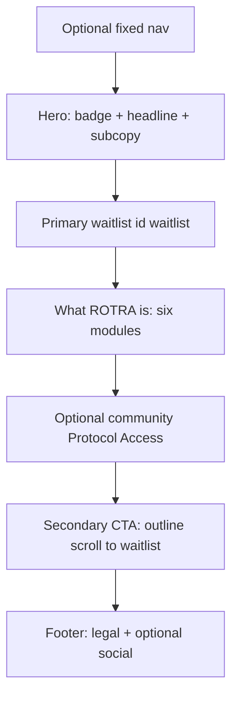

# ROTRA — Coming soon & waitlist landing page (story spec)

This document describes **vibe, section order, copy direction, and image prompts** for a single marketing page: **coming soon**, **join the waitlist**, and a **short product overview**. It is a **spec only** — not a build ticket for a specific framework.

**Authoritative design reference:** [Branding / design system](../branding.md) — tokens, components, motion, logo, and accessibility minimums **must** match that document when the page is implemented.

**Product narrative reference:** [Product vision](../business_logic/client_app/01_product_vision.md) — problems solved, audiences, and principles; keep the landing page aligned but much shorter.

---

## 1. Purpose and audience

The page exists to **capture waitlist signups first**, then **explain what ROTRA is in under a minute**, then **invite signup again** before a minimal **footer**. Nothing on the page should compete with the waitlist as the main job-to-be-done.

**Primary audience (same as product vision):**

- Casual to semi-competitive players who attend club sessions
- Que masters who run rotation manually today
- Club owners who want structure and records without heavy admin

Tone: **utility-first** — this is infrastructure for sessions, not a social network pitch.

---

## Stitch reference — MCP export (“Kinetic Precision”)

This landing story can follow a **concrete layout blueprint** produced outside the repo (Stitch / design MCP). Treat that export as **visual and IA reference**, not as copy-paste truth for product claims or brand tokens.

### Source files (authoritative for the mock)

| Artifact | Location |
|----------|----------|
| Design strategy | `file:///Users/joseadrianbuctuanon/Downloads/stitch_rotra_ui_toolkit_dashboard/DESIGN.md` |
| HTML prototype | `file:///Users/joseadrianbuctuanon/Downloads/stitch_rotra_ui_toolkit_dashboard/code.html` |

**Optional — vendor into git:** copy both files to [`docs/marketing/references/stitch-rotra-landing/`](references/stitch-rotra-landing/) (create the folder when checking in) so links stay stable for the team.

### Visual reference (screenshot)

The exported page shows: **fixed glass nav** (mark + wordmark + header CTA), **full-bleed hero** (dark indoor court photography + gradient scrim), **COMING SOON** pill, large **Queue. Play. Track.** headline (accent on “Track.”), subhead, **glass waitlist** row (email + primary button), fine print, **“Core Architecture”** band with **3×2 module grid** (icons + MODULE labels + titles + body), **“Protocol Access”** community band (social placeholders + status chips), and **footer** (wordmark, © line, links, small utility icons).

**Repo asset (recommended):** save a PNG of that mock as [`docs/marketing/assets/coming-soon-stitch-reference.png`](assets/coming-soon-stitch-reference.png) and embed or link it from this doc so the spec is portable (the Cursor project `assets/` copy may not live inside `rotra-app`).

### Creative north star (from `DESIGN.md`, summarized)

- **Kinetic precision** — editorial, “flight instrument” density for power users; status-first hierarchy.
- **Tonal surfaces** — depth from **background shifts** and soft value steps; Stitch’s **“No-Line”** rule discourages hard 1px section borders (differs from [branding](../branding.md) card borders — see compliance below).
- **Accent as signal** — neon green for action / life; optional **inner glow / gradient** on primary CTAs in the Stitch system (differs from branding’s **flat** accent fill — see compliance).

### Stitch regions → this document

| Stitch block (`code.html`) | Maps to in this spec |
|----------------------------|----------------------|
| Fixed header + logo + “Get Early Access” | Optional **top nav**. Header CTA must respect **one filled accent primary** → implement as **outline** control that **scrolls to `#waitlist`** (not a second solid green button next to the hero submit). |
| Hero (badge, headline, subcopy, email + CTA, fine print) | **Hero + primary waitlist**; wrap the form block in **`id="waitlist"`**. |
| Core Architecture / 3×2 modules | **What ROTRA is** — use the **six vision-accurate modules** in §3 (replace Stitch placeholder copy such as “biometric” or generic “AI-driven” hype). |
| Protocol Access / social / status chips | **Optional community / secondary story** — keep honest (clubs, waitlist updates); social URLs **placeholders** until real. |
| Footer | **Footer** — **© ROTRA** + year; include **Privacy** and **Terms** placeholders per §3; avoid fictional entity names unless legally intended. |

### Compliance choices vs [branding](../branding.md)

| Topic | Stitch / HTML prototype | Production alignment |
|-------|-------------------------|------------------------|
| **Typography** | Inter, heavy **all-caps** display lines | Prefer **Satoshi** (branding §3) for wordmark; **do not** set entire hero lines in all-caps unless shortened to label-scale — use **Title Case** or sentence case for long headlines; keep **COMING SOON**, **MODULE 0x**, and **button labels** in caps (`text-label` / `text-micro`). |
| **Rough color map** | `surface_container_lowest` `#0E0E0F`, `surface_container` `#201F20`, `surface_container_high` `#2A2A2B`, `primary_container` `#00FF88`, `on-primary-fixed` `#00210C` | Near [branding §2](../branding.md): `color-bg-base` `#0B0B0C`, `color-bg-surface` `#1A1A1D`, `color-bg-elevated` `#2A2A2E`, `color-accent` `#00FF88`, primary button text `#0B0B0C`. |
| **Primary button** | Gradient `primary` → `primary_container` | Branding §7 specifies **flat** `color-accent` + `shadow-accent`. **Either** normalize to flat for brand audit **or** document a **marketing-only** exception and still meet contrast (branding §12). |
| **Surfaces / borders** | “No-line,” ghost borders, glass `backdrop-blur` | Branding uses **1px** card borders and `shadow-card`. Marketing may use **glass + tonal layers** if reviewed; reconcile with design lead. |
| **Icons** | Material Symbols | Prefer **Lucide / Phosphor** stroke icons (branding §8). |
| **Motion** | Pulsing dot on “Coming Soon” | Branding §9: avoid **decorative** motion — use **static** indicator or honor **`prefers-reduced-motion`**. |
| **Layout width** | `max-w-[1440px]` shell | **Full-bleed hero** and wide bands are fine. Keep **waitlist + long reading text** in a **~480px** inner column (branding §4) for readability and parity with the app. |

---

## 2. Vibe and visual direction (implements [branding](../branding.md))

### Brand identity (branding §1)

- **Name in UI:** ROTRA (all caps).
- **Tagline:** Run the game.
- **Positioning line:** The operating system for badminton sessions — queue management, skill tracking, and match flow in one place.
- **Personality:** Precise · Fast · Neutral · Reliable — calm, confident, no gimmicky marketing noise.

### Color and surfaces (branding §2)

| Area | Token / hex | Notes |
|------|-------------|--------|
| Page background | `color-bg-base` `#0B0B0C` | Full viewport |
| Waitlist card, overview cards | `color-bg-surface` `#1A1A1D` | Use `shadow-card` |
| Inputs | `color-bg-elevated` `#2A2A2E` | 1.5px `color-border` default |
| Primary text | `color-text-primary` `#F0F0F2` | Headlines, labels |
| Secondary text | `color-text-secondary` `#9090A0` | Hints, placeholders, footer |
| Primary CTA | `color-accent` `#00FF88` | Button fill; `shadow-accent` |
| Borders | `color-border`, `color-border-strong` | Cards vs strong outlines |

### Typography (branding §3)

- **Font:** Satoshi, fallback Inter / system-ui / sans-serif.
- **Mapping:** Hero headline → `text-display` (28px / 700). Section titles → `text-title` or `text-heading`. Body → `text-body`. Microcopy / legal → `text-small`.
- **All caps:** Only on `text-label` and `text-micro` (e.g. button label **JOIN THE WAITLIST**, tiny “COMING SOON” badge) — **not** on long headlines.

### Layout (branding §4)

- **Spacing:** 4px base; generous **vertical rhythm** between sections (`space-8` / `space-10`).
- **Horizontal padding:** 16px mobile, 24px tablet.
- **Max content width:** **480px** centered — matches app density; waitlist stays the visual anchor.

### Elevation (branding §6)

- Waitlist panel + overview cards: **`shadow-card`**.
- Primary submit control: **`shadow-accent`**.

### Components (branding §7) — implement literally

**Primary button — “Join the waitlist”**

- Background `color-accent`; text `#0B0B0C`; typography `text-label`, **uppercase**.
- Height **48px**; horizontal padding **24px**; border radius **`radius-md` (10px)**.
- Box shadow: **`shadow-accent`**.
- Pressed: background **`color-accent-dim`**, scale **0.97**.

**Secondary actions** (e.g. scroll to story, external social)

- **Outline secondary button:** transparent bg, **1.5px** border `color-border-strong`, text `color-text-primary`, `text-label` uppercase; pressed → `color-bg-elevated`.

**Inputs**

- Height **48px**; `color-bg-elevated`; **1.5px** solid `color-border`; `radius-md`; inner padding 0 `space-4`.
- Placeholder `color-text-secondary`; focus border **`color-accent`**; validation errors → **`color-error`**.

**Overview “pillars”**

- Use **card** spec: `color-bg-surface`, **1px** `color-border`, **`radius-lg`**, padding **`space-6`**, `shadow-card`.
- Optionally highlight **one** pillar with **active card** cues (e.g. **1px** border `color-accent-dim` and/or **3px** left stripe `color-accent`) — use once so the page does not look noisy.

**Success after submit**

- Prefer **toast** spec: background `color-bg-overlay`, `radius-lg`, padding 12px 16px, max width 320px, slide down + fade **200ms** ease-out (branding §7).
- Example success copy: **“You’re in.”** or **“Thanks — we’ll email you.”** — short, on-brand, not a queue notification parody.

### Iconography (branding §8)

- Stroke icons, **1.5px** stroke, **20px** default; **Lucide** or **Phosphor** regular. Accent-colored icons only where accent carries meaning (e.g. checkmark on success).

### Motion (branding §9)

- **No decorative animation** for chrome, lists, and primary flows. Meaningful transitions only: toast, focus, submit loading state. If any hero treatment animates, cap at **`motion-default` (~200ms)** and keep it subordinate to text readability.
- **Marketing-only exception (this landing page):** subtle ambient layers in the hero (see **Atmospheric layers** below) are allowed. Continuous motion **must** respect **`prefers-reduced-motion`** — degrade to a static scrim or omit the ambient layer when reduced motion is requested.

### Atmospheric layers (implementation)

This section supplements §3 “Hero” (photo + scrim) with an optional **depth stack** and a **readability fade** at the hero base. It remains **spec guidance** for whichever implementation the client app ships.

**Layer order (back → front)**

1. **Hero media** — static `next/image` (or illustration) filling the hero; no generated logos in-image (branding §10).
2. **Optional WebGL “dark veil”** (e.g. a canvas-based atmospheric layer such as [`DarkVeil`](../../apps/landing/src/components/ui/dark-veil/DarkVeil.tsx) if adopted) — full-bleed, `position: absolute; inset: 0`, **below** the scrim. Use restrained parameters (`noiseIntensity`, `scanlineIntensity`, `warpAmount` at or near **0**) so the read is **tonal depth**, not retro scanlines.
3. **Gradient scrim** — use Tailwind/theme tokens (`bg-base`, `bg-surface`, opacity steps); avoid ad-hoc hex in JSX ([coding design system](../techstack/05_coding_design_system.md) §4.3).
4. **Typography + hero CTAs** — badge, headline, subcopy; relative `z-index` above the veil.
5. **Gradual bottom blur** — implement via [React Bits — GradualBlur](https://reactbits.dev/animations/gradual-blur) (or equivalent stacked `backdrop-filter` masks). Typical props: `target="parent"`, `position="bottom"` on the **hero `<section>`** so the bottom edge softly blurs into the next band (e.g. waitlist). Optional second instance: `position="top"` for a fixed glass nav over scrolling content. Suggested defaults: `curve="bezier"`, `exponential={true}`, `divCount={5}`, `strength={2}`, `height="6rem"` (tune per art direction). The upstream sample uses `mathjs` for `pow`/`round`; a production port can use **native `Math` only** to avoid an extra dependency.

**`backdrop-filter` / Safari**

- Keep the hero wrapper `position: relative` and clipping intentional: parent `overflow` interacts with blurred edges. Prefer `isolation: isolate` on the blur stack; verify in Safari that headline type stays sharp and the blur reads as a **vignette**, not muddy type.

**Storybook**

- When building these pieces, add colocated `*.stories.tsx` per [file naming / Storybook conventions](../techstack/06_file_naming_conventions.md). A composed “hero stack” story (media + veil + scrim + copy + gradual blur) is useful for design review before wiring a public route.

**Engineering checklist**

| Step | Action |
|------|--------|
| 1 | Hero `<section>`: `position: relative`, explicit `min-height`, inner content column as in branding §4. |
| 2 | Optional atmospheric canvas + scrim + copy; gradual blur as the last visual layer inside the same section (preserve stacking order). |
| 3 | Centralize hero copy fixtures for Storybook + page in app `constants/` per [naming conventions](../techstack/06_file_naming_conventions.md) (pure data, no inline blobs in stories). |
| 4 | If porting React Bits `GradualBlur` verbatim, note the sample’s `mathjs` dependency — a slim port can use **`Math.pow` / rounding** only. |
| 5 | Lint + typecheck; verify stories for each new UI primitive and any composed hero. |

**Route note:** swapping this stack into the client home route is a separate product decision; a dev placeholder shell can remain until launch.

### Logo (branding §10)

- Wordmark **ROTRA**: Satoshi **700**, tracking **-1px to -2px**; on dark backgrounds use **`color-text-primary`**.
- Respect **minimum wordmark size** and clear space in the header/footer.
- **Do not** rely on AI-generated hero art for the official logo — ship the real wordmark in layout.

### One primary green CTA (branding §11, adapted)

Branding: **one primary action per screen** (single green filled button).

**Recommended pattern for this long page:**

- **Single waitlist block** with id **`waitlist`** (e.g. `<section id="waitlist">`) containing the **only** filled **`color-accent`** submit for the whole scroll experience **OR** ensure **at most one** filled accent primary is visible in the viewport at once (harder to guarantee).
- **Secondary CTA zone** (after the story): **outline** button **“Join the waitlist”** that **scrolls to `#waitlist`** and focuses the email field — **no second green filled button**. This avoids two competing primaries and keeps implementation honest to the design system.

### Accessibility (branding §12)

- Contrast: WCAG **AA** for body text on `bg-base` / `bg-surface`; large text **3:1** where applicable.
- Touch targets **≥ 44×44px**.
- Focus: **2px** solid `color-accent` outline, **2px** offset.

---

## 3. Page story (top to bottom)

**Stitch-inspired flow** (same job-to-be-done as before — waitlist first — with optional nav and community band from the MCP export):

**Optional fixed nav → hero (photo + scrim) → primary waitlist → what ROTRA is (3×2 grid) → optional community band → secondary CTA → footer.**



### Section-by-section

| Section | Role |
|--------|------|
| **Optional top nav** | Fixed **glass** bar (Stitch reference): mark + **ROTRA** wordmark (branding §10). Right control labeled e.g. **GET EARLY ACCESS** → **outline** only, **scroll to `#waitlist`** — not a second filled accent primary beside the hero form. |
| **Hero** | Full-bleed **static photo** of a dark indoor court (see §7 — `next/image`, local asset). Gradient scrim for text contrast. **COMING SOON** pill (`text-micro` / `text-label`). Headline variant **Queue. Play. Track.** — optional **accent color or gradient on the last word only** as a *visual treatment*; keep typography rules from the **Stitch vs branding** table. **Product-honest subcopy** (see below). Include tagline **Run the game.** if space allows. |
| **Primary waitlist** | **Glass or card** panel (Stitch) wrapping email + **JOIN THE WAITLIST**; inner column **~480px** max width inside the wide shell. **`id="waitlist"`** on the wrapping section. **Email** required; optional name / role segmentation. One **flat** primary per branding §7 unless an approved marketing exception is recorded. Optional fine print line (keep factual, not sci-fi). |
| **What ROTRA is** | **“Core architecture”** band: eyebrow (small caps) + large title + short right column intro (Stitch layout). **3×2 grid** of modules; each: icon (Lucide/Phosphor), **MODULE 0x** label, **Title Case** title, one sentence body — copy from **Six vision-accurate modules** below (not the HTML prototype’s biometric / generic ML claims). |
| **Optional community** | **“Protocol access”**-style band: headline + paragraph about waitlist / club updates + **social placeholders** + optional status chips (e.g. early access, changelog) — all **honest**; no fake “alpha protocol” codes unless real. |
| **Secondary CTA** | **Outline** **JOIN THE WAITLIST** → scroll to `#waitlist` + focus email. No second solid green primary. |
| **Footer** | Wordmark + **© ROTRA** and the **calendar year at publish time**. Links: **Privacy**, **Terms**, waitlist anchor, support/contact as needed. Optional small icon buttons (stroke icons). |

### Suggested copy (draft — editable)

**Headline options** (pick one for ship):

1. **The badminton session platform**
2. **Queue. Play. Track.** (Stitch default — accent or gradient on **Track.** only if desired)

**Subcopy (product-honest — replaces “elite competitive / biometric” language from the HTML prototype):**

- The operating system for **badminton club nights** — fair rotation, **live** queue state, and history you can trust.

**Alternative one-liner:**

- Fair queues, live sessions, and player identity across the clubs you play in.

**Tagline (near hero):**

- Run the game.

**Waitlist placeholder (Stitch tone, optional):**

- Enter your email — or use neutral placeholder copy; avoid implying data collection you do not perform.

**Waitlist helper text:**

- We’ll only email you about the launch and early access.

**Architecture band eyebrow / title (Stitch-style labels, editable):**

- Eyebrow: **Core architecture** (or **What ROTRA does**)
- Title: **High-efficiency session stack** (or keep **High-efficiency protocol** if brand approves the tone)

**Optional community band:**

- Eyebrow: **Stay in the loop** (friendlier than “Protocol access” unless you want that voice)
- Title: **Join the waitlist community** — short paragraph: updates on launch, clubs, and how sessions work in ROTRA.

**Six vision-accurate modules** (replace Stitch `code.html` bodies — aligned to [product vision](../business_logic/client_app/01_product_vision.md); scoring wording informed by [umpire scoring interface](../business_logic/umpire_app/03_scoring_interface.md), without claiming unsupported “AI validation”):

| Module | Title | One-line body |
|--------|-------|----------------|
| **01** | Fair queues | Structured rotation so court time is predictable — less arguing over who’s up next. |
| **02** | Live sessions | Queue and match state stay **current** so players and que masters are not working off stale info. |
| **03** | Player stats & identity | Profiles and match history that **persist** across clubs you play in. |
| **04** | Reviews & skill signal | Post-match reviews and skill signals that stay **credible** and tied to real play. |
| **05** | Club sessions & members | Clubs as the unit for **sessions, invites, and membership** — the way real communities already organize. |
| **06** | Court & shuttle costs | **Transparent** splits for courts and shuttles so money conversations match what actually happened. |

---

## 4. Image generation prompts (design / AI)

These prompts are **Nano Banana Pro–ready**: each asset is a **single JSON object** using the common structured schema (`meta`, `subject`, `scene`, plus framing and negatives). That format maps to tools and docs that accept **JSON prompts for Nano Banana Pro** (including the **Gemini 3 Pro / “Ultimate Image”**-style schema used in community generators).

**How to use:** Paste **one** JSON object per generation. If your UI only accepts a subset of keys, prioritize **`meta`**, **`subject`**, **`scene`**, and **`advanced.negative_prompt`**. Set **`text_rendering.enabled`** to **`false`** so the model does not invent lettering (the real ROTRA wordmark ships in layout — branding §10).

**Brand rules (all three):** Do **not** render readable text, logos, or app chrome in-image. Palette matches [branding §2](../branding.md): base `#0B0B0C`, surfaces `#1A1A1D` / `#2A2A2E`, neutrals `#F0F0F2` / `#9090A0`, accent `#00FF88` **sparingly**.

### Hero background — 16:9

```json
{
  "user_intent": "ROTRA coming-soon hero: dark editorial tech illustration, abstract badminton queue and court grid, generous empty space on left third for real wordmark overlay in CSS",
  "meta": {
    "aspect_ratio": "16:9",
    "quality": "vector_illustration",
    "guidance_scale": 8,
    "steps": 40,
    "safety_filter": "block_some"
  },
  "subject": [
    {
      "id": "hero_graphic",
      "type": "object",
      "description": "Abstract badminton court as faint isometric or perspective grid lines, very low contrast strokes in #9090A0. Minimal non-photoreal shuttlecock: small gray-white cone with single thin motion streak. Five to seven tiny circular nodes along a gentle arc, linked by hairline strokes suggesting queue order; exactly ONE node marked with accent dot #00FF88, all others neutral gray. Optional subtle geometric orbit or rotation curve in one corner suggesting queue loop — not a logo mark. No characters.",
      "position": "center"
    }
  ],
  "scene": {
    "location": "abstract void, editorial tech product illustration, no physical room",
    "time": "pitch_black",
    "lighting": {
      "type": "studio_softbox",
      "direction": "front_lit"
    },
    "background_elements": [
      "dominant field #0B0B0C",
      "layered charcoal planes #1A1A1D and #2A2A2E with subtle separation only, no noisy texture",
      "high-contrast negative empty space occupying left third of frame for headline and wordmark overlay"
    ]
  },
  "composition": {
    "framing": "wide_shot",
    "angle": "eye_level",
    "focus_point": "whole_scene"
  },
  "text_rendering": {
    "enabled": false
  },
  "style_modifiers": {
    "medium": "digital_illustration",
    "aesthetic": ["minimalist", "futuristic"]
  },
  "advanced": {
    "negative_prompt": [
      "people",
      "faces",
      "hands",
      "human figures",
      "text",
      "letters",
      "words",
      "watermark",
      "logo",
      "brand name",
      "app screenshot",
      "browser UI",
      "photorealistic",
      "busy texture",
      "neon cyberpunk",
      "mascot",
      "cartoon character",
      "low quality",
      "blur"
    ],
    "magic_prompt_enhancer": false,
    "hdr_mode": false
  }
}
```

### Section divider / spot illustration — ~3:1 or crop from wide

Use **`21:9`** below as the closest standard ratio to a thin strip; **crop center** to ~3:1 if your tool lacks an exact 3:1 preset.

```json
{
  "user_intent": "ROTRA section divider: tiny dark-mode spot graphic between text blocks at 320-480px content width",
  "meta": {
    "aspect_ratio": "21:9",
    "quality": "vector_illustration",
    "guidance_scale": 8,
    "steps": 36,
    "safety_filter": "block_some"
  },
  "subject": [
    {
      "id": "divider_motif",
      "type": "object",
      "description": "Minimal line art: three horizontal lines morphing into simple badminton court rectangle outline. Stroke colors #F0F0F2 and #9090A0, hairline weight. Exactly one short stroke or glow segment in #00FF88 only. Centered small composition with generous padding.",
      "position": "center"
    }
  ],
  "scene": {
    "location": "flat dark canvas",
    "time": "pitch_black",
    "background_elements": [
      "solid #0B0B0C",
      "no icons with readable glyphs",
      "no mascots"
    ]
  },
  "composition": {
    "framing": "extreme_wide_shot",
    "angle": "eye_level",
    "focus_point": "whole_scene"
  },
  "text_rendering": {
    "enabled": false
  },
  "style_modifiers": {
    "medium": "digital_illustration",
    "aesthetic": ["minimalist"]
  },
  "advanced": {
    "negative_prompt": [
      "people",
      "faces",
      "text",
      "letters",
      "logo",
      "watermark",
      "busy background",
      "3d render photorealistic",
      "low quality"
    ],
    "magic_prompt_enhancer": false,
    "hdr_mode": false
  }
}
```

### Open Graph / social preview — 1:1 (1200×1200 safe zone)

```json
{
  "user_intent": "ROTRA OG square: flat abstract mark only; app overlays real ROTRA typography in HTML",
  "meta": {
    "aspect_ratio": "1:1",
    "quality": "vector_illustration",
    "guidance_scale": 7.5,
    "steps": 36,
    "safety_filter": "block_some"
  },
  "subject": [
    {
      "id": "og_mark",
      "type": "object",
      "description": "Single centered abstract symbol: simplified shuttlecock silhouette in #F0F0F2 with one short accent tail or arc segment in #00FF88 only. Geometric, PWA-icon seriousness, readable at small sizes. Keep outer 10 percent margin empty for platform cropping.",
      "position": "center"
    }
  ],
  "scene": {
    "location": "flat graphic field",
    "time": "pitch_black",
    "background_elements": [
      "solid #0B0B0C",
      "optional extremely subtle radial lift from #0B0B0C to #1A1A1D at center only"
    ]
  },
  "composition": {
    "framing": "medium_shot",
    "angle": "eye_level",
    "focus_point": "foreground_object"
  },
  "text_rendering": {
    "enabled": false
  },
  "style_modifiers": {
    "medium": "digital_illustration",
    "aesthetic": ["minimalist"]
  },
  "advanced": {
    "negative_prompt": [
      "text",
      "letters",
      "words",
      "ROTRA",
      "logo typography",
      "watermark",
      "people",
      "photo",
      "busy pattern",
      "low quality"
    ],
    "magic_prompt_enhancer": false,
    "hdr_mode": false
  }
}
```

---

## 5. Conversion and implementation notes

- **Above the fold:** On common phone heights, the **email field + primary button** should be visible without scrolling, or within one short scroll — hero must stay **compact**.
- **Submit:** Disable primary and show loading state while the request is in flight; re-enable on failure.
- **Errors:** Inline message under the field and/or `color-error` border; keep copy short (“Check your email address.”).
- **Double-submit:** Guard with disabled button or request idempotency on the backend (out of scope for this doc).

All contrast, focus, and touch-target rules remain as in [branding §12](../branding.md).

---

## 6. Related documents

- [Branding / design system](../branding.md)
- [Product vision](../business_logic/client_app/01_product_vision.md)

---

## 7. Implementation stack and performance

This section records the **intended technical stack** and **performance posture** when the page is implemented. It does not replace app-specific engineering decisions.

### Stack

- **Next.js** and **React** for the landing route(s) and any small interactive pieces (e.g. waitlist form).
- **Tailwind CSS** using the **same configuration pattern** as other Next apps: extend the shared preset from `@rotra/config/tailwind`, as in [`apps/landing/tailwind.config.ts`](../../apps/landing/tailwind.config.ts) (`import baseConfig from "@rotra/config/tailwind"`, spread `...baseConfig`, and set `content` so Tailwind sees every file that uses utility classes). Widen `content` globs only when new folders hold landing components.
- Prefer reusing shared UI from **`@rotra/ui`** (when present in the workspace and wired in the app’s `next.config`) when primitives already match the design system, so styling and behavior stay consistent with the rest of the product.

### Static-first and cost

Keeping the marketing page **as static as possible** is the right default: the **HTML shell** should be **pre-rendered at build time** (or otherwise **strongly cached**) and served from the **CDN / edge** with **minimal per-request Node work**. That improves TTFB and keeps cost lower than forcing **SSR or dynamic rendering** on every anonymous visit.

**Nuance:** the **waitlist submit** still needs a **dynamic path** — e.g. a **Route Handler / API route**, a **Server Action**, or a **third-party form POST URL**. Only that **submit** should routinely hit compute or an external service; the **hero, copy, layout, and imagery** should not depend on per-request database reads or `force-dynamic` unless there is a concrete requirement.

**Next.js-oriented guidelines (high level):**

- Prefer **static generation** for the landing page itself; avoid opting the route into dynamic rendering without a reason.
- Avoid unnecessary `fetch(..., { cache: 'no-store' })` (or equivalent) on the landing route for data the page does not need at request time.
- Keep the **client JS bundle small**: default to **Server Components** where possible; use **Client Components** only for the form and other true interactivity; lazy-load anything non-critical below the fold if it meaningfully adds weight.
- Ship **hero / OG / social** imagery as **static or build-time assets** where possible (e.g. committed images or build output), instead of generating pixels per request.
- **Photographic hero** (Stitch reference): use **`next/image`** with a **committed static file** under `public/` (or the app’s static image convention) — **do not** hotlink a CDN URL as in the HTML prototype; set **`priority`** only if LCP is that image, otherwise lazy below-the-fold assets.

---

## Out of scope

This document does **not** ship production code, analytics, CRM integration, or email-provider wiring. **§7** states the **intended stack** (Next.js, React, Tailwind via shared config) and **static-first performance posture** for implementers. Everything else remains **story, structure, visual direction, and copy**.
